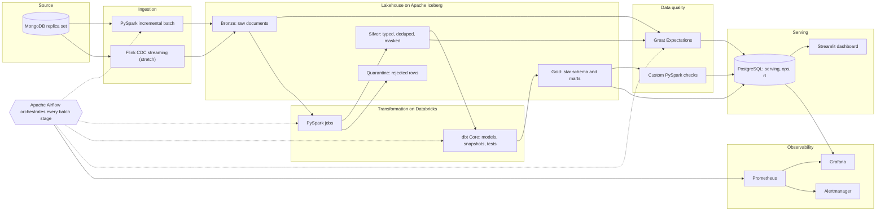
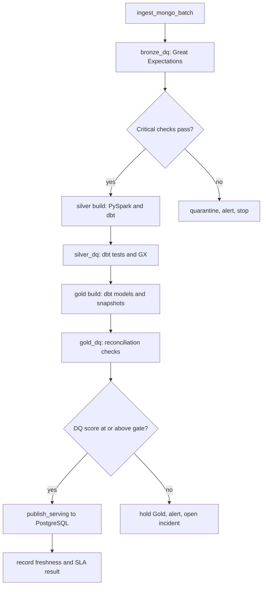

# Banking Data Platform: Architecture

Status: Draft v1
Last updated: 2026-09-20

This document describes the target architecture for a production grade banking data pipeline. It covers what is built, why each piece exists, and the rules every component follows. The delivery sequence lives in `project_plan.md`.

---

## 1. Purpose and scope

### 1.1 Goal

Ingest banking data from MongoDB, land it in an Apache Iceberg lakehouse, transform it with PySpark and dbt on Databricks, validate it with layered data quality checks, and serve it through PostgreSQL and a Streamlit dashboard. Every stage is orchestrated by Airflow, monitored against explicit SLAs, SLOs and freshness targets, provisioned by Terraform, and shipped through GitHub Actions.

### 1.2 In scope

* Batch incremental ingestion from MongoDB into Bronze
* Near real time change capture with Flink (stretch phase)
* Bronze, Silver and Gold layers on Iceberg
* Kimball style dimensional model with SCD Type 2 dimensions
* Multi layer data quality with quarantine and a publish gate
* Serving layer, ops metadata and a Streamlit dashboard
* Monitoring, alerting, SLA, SLO and freshness tracking
* Infrastructure as code, CI/CD and local git hooks

### 1.3 Out of scope

* Machine learning models and a real fraud scoring engine
* Multi region disaster recovery
* Real customer data. The controls below are designed as if the data were real, but the dataset is assumed to be synthetic.

### 1.4 Assumptions

* MongoDB holds collections such as `customers`, `accounts`, `transactions`, `branches`, `loans` and `cards`. Rename to match your actual collections.
* One engineer, local first. Cloud resources (Databricks, object storage) are used only where a phase needs them.
* Python dependencies are managed with `uv`. Secrets live in `.env` locally and are never committed.
* All timestamps are stored in UTC. SLAs are evaluated in the business timezone configured in `.env`.

---

## 2. Design principles

1. **Idempotent everywhere.** Any task can be re run for the same window and produce the same result.
2. **Contracts at boundaries.** Every hop (source to Bronze, Silver to Gold, Gold to serving) has a declared schema and checks.
3. **Fail closed on Gold.** Bad data may be quarantined or held, but it never reaches Gold or the dashboard silently.
4. **Everything as code.** Infrastructure, pipelines, dashboards, alerts and quality rules live in the repo.
5. **Observable by default.** Every run emits metrics, structured logs and a row in `ops` tables.
6. **Least privilege.** Each service has its own role with only the grants it needs.
7. **Environment parity.** Local, dev, staging and prod differ by configuration, not by code.
8. **Small, reversible changes.** Short branches, slim CI, and rollback by re running a tagged release.

---

## 3. High level architecture

### 3.1 System view



### 3.2 Daily pipeline flow



### 3.3 Component responsibilities

| Component | Role | Key design choice |
|---|---|---|
| MongoDB | Source of record | Runs as a replica set (required for change streams). Batch reads use the secondary. |
| PySpark | Ingestion, cleansing, heavy joins | Packaged as a wheel. Runs in local mode for dev and on Databricks for real volume. |
| Apache Flink | Streaming CDC and windowed aggregates | Stretch phase. Flink SQL jobs, checkpoints to object storage. |
| Apache Iceberg | Open table format for every lake layer | Format version 2, merge on read, catalog backed by PostgreSQL. |
| Databricks | Managed Spark compute and the dbt target | Jobs run under a service principal. Provisioned by Terraform. |
| dbt Core | Modelling, snapshots, tests, docs | SQL models plus Python (PySpark) models for heavy logic. |
| Great Expectations | Declarative validation and Data Docs | Suites per layer. Results persisted to `ops.dq_results`. |
| Apache Airflow | Orchestration and scheduling | TaskFlow API, dynamic task mapping, Cosmos for dbt. |
| PostgreSQL | Serving warehouse, ops metadata, Iceberg catalog, Airflow metadata | Separate databases and roles per purpose. |
| Streamlit | Dashboard | Reads only from the serving schema through a read only role. |
| Prometheus, Grafana, Alertmanager | Metrics, dashboards, alert routing | Exporters for Postgres, Airflow (StatsD), Flink and containers. |
| Terraform (HCL) | Infrastructure as code | Modules per concern, remote state, one variable file per environment. |
| Docker Compose | Local runtime | Profiles so you start only what a task needs. |
| GitHub Actions, git hooks | Quality gates and delivery | Hooks give fast local feedback. CI repeats every check and cannot be skipped. |
| Make, batch files, shell, PowerShell | Automation | One command surface on every OS. |

---

## 4. Environments and runtime topology

### 4.1 Environments

| Environment | Where it runs | Purpose |
|---|---|---|
| local | Docker Compose on the developer machine | Daily development, unit and integration tests on sample data |
| dev | Small cloud footprint, dev Databricks workspace | Integration tests against real Databricks |
| staging | Production like, sampled or full data copy | Release validation, SLA rehearsal |
| prod | Production footprint | Scheduled runs, dashboards, alerting |

### 4.2 Docker Compose profiles

| Profile | Services |
|---|---|
| `core` | postgres, mongo (replica set plus init container), S3 compatible object store plus bucket init, Spark (local mode or standalone) |
| `orchestration` | Airflow api server, scheduler, dag processor, triggerer |
| `streaming` | Flink jobmanager, taskmanager, SQL gateway |
| `quality` | Nginx serving Great Expectations Data Docs |
| `monitoring` | Prometheus, Grafana, Alertmanager, Pushgateway, postgres exporter, StatsD exporter, cAdvisor |
| `dashboard` | Streamlit |

### 4.3 Practical constraints to plan around

* **MongoDB change streams need a replica set.** A standalone `mongod` will not work for Flink CDC. The compose file starts Mongo with `--replSet rs0` and an init container runs `rs.initiate()`.
* **Terraform needs API access to Databricks.** Databricks Community Edition does not offer it. Use a trial or paid workspace for the `databricks` Terraform provider, and keep the local environment on the Docker, PostgreSQL and object store providers.
* **Local S3.** MinIO is the usual local S3 compatible store. Check that you can still pull a maintained image. If not, use SeaweedFS or Garage. Only the endpoint variable changes.

---

## 5. Ingestion

### 5.1 Source collections and modes

| Collection | Grain | Change pattern | Ingestion mode | Watermark |
|---|---|---|---|---|
| `customers` | One document per customer | Slowly changing | Incremental | `updated_at` |
| `accounts` | One document per account | Balance and status change often | Incremental plus CDC | `updated_at` |
| `transactions` | One document per transaction | Append heavy | Incremental plus CDC | `created_at` then `_id` |
| `branches` | One document per branch | Rarely changes, small | Full refresh | None |
| `loans` | One document per loan | Slowly changing | Incremental | `updated_at` |
| `cards` | One document per card | Status changes | Incremental | `updated_at` |

Adjust after profiling the real collections. Choose the watermark field per collection from a field that is reliably set on every write.

### 5.2 Batch incremental design

1. Read the last successful watermark for the collection from `ops.ingestion_watermarks`.
2. Query `watermark_field > last_watermark minus overlap`. The overlap window (default 10 minutes) protects against late commits and clock skew.
3. Read through the MongoDB Spark connector with `secondaryPreferred`, partitioned by `_id` ranges so reads run in parallel without loading the primary.
4. Add lineage columns, write to Bronze in one Iceberg transaction, then advance the watermark only after the write commits.
5. On re run, delete any rows for the same `_batch_id` first. This makes the write idempotent.

Full refresh collections are overwritten in one Iceberg transaction.

### 5.3 Bronze table contract

| Column | Type | Meaning |
|---|---|---|
| `_id` | string | MongoDB document id |
| `_doc` | string | Full document as JSON. No parsing at this layer. |
| `_op` | string | `snapshot`, `insert`, `update` or `delete` |
| `_source_ts` | timestamp | Source change or update time |
| `_ingested_at` | timestamp | When the row landed |
| `_batch_id` | string | Ingestion batch identifier |
| `_run_id` | string | Airflow run identifier |
| `_source_collection` | string | Origin collection |
| `_schema_version` | string | Contract version used to validate the batch |
| `_doc_hash` | string | Hash of `_doc`, used for change detection and dedupe |

Bronze is append only. Nothing is cleaned, cast or dropped here.

### 5.4 Schema drift handling

Each collection has a YAML contract (`contracts/<collection>.yml`) listing fields, types and nullability.

* **New field:** warn, keep it in the raw document, open a ticket to add it to the contract.
* **Removed field:** warn, and fail only if the field is marked required.
* **Type change:** fail closed for that collection, quarantine the batch, alert.

### 5.5 Nested documents

Arrays and embedded documents (for example account holders inside an account) are exploded in Silver into child tables that carry the parent key. Bronze keeps the document intact so Silver can be rebuilt from Bronze at any time.

---

## 6. Lakehouse on Apache Iceberg

### 6.1 Catalog

Default: a JDBC catalog stored in the `iceberg_catalog` PostgreSQL database. It works for Spark and Flink with no extra service.

Alternatives for cloud: a REST catalog (Apache Polaris, Lakekeeper) or Unity Catalog.

Decision to confirm early (ADR 3): Databricks is Delta native. Confirm that your workspace tier supports reading and writing Iceberg tables through Unity Catalog. If it does not, the fallback is Iceberg for Bronze and streaming outputs, Delta for Silver and Gold, with Iceberg reads enabled through UniForm where another engine needs them. Only the dbt target configuration changes.

### 6.2 Storage layout

```
s3://<bucket>/<env>/warehouse/<layer>/<table>/
s3://<bucket>/<env>/checkpoints/flink/
s3://<bucket>/<env>/dq_docs/
s3://<bucket>/<env>/artifacts/dbt/
```

### 6.3 Standard table properties

```
format-version                    = 2
write.format.default              = parquet
write.parquet.compression-codec   = zstd
write.target-file-size-bytes      = 134217728
write.delete.mode                 = merge-on-read
write.update.mode                 = merge-on-read
write.merge.mode                  = merge-on-read
history.expire.max-snapshot-age-ms = 604800000
```

### 6.4 Partitioning

| Table | Partition | Reason |
|---|---|---|
| Bronze tables | `days(_ingested_at)` | Cheap replay by batch date |
| `silver.transactions` | `days(txn_ts)` | Range filters on transaction date |
| Other Silver and Gold tables | None, or `months(...)` when large | Avoid over partitioning small tables |

### 6.5 Maintenance

| Procedure | Frequency | Purpose |
|---|---|---|
| `rewrite_data_files` (bin pack) | Daily | Compact small files, especially from streaming |
| `rewrite_manifests` | Weekly | Keep planning fast |
| `expire_snapshots` | Daily | Bronze 7 days, Silver and Gold 30 days (time travel window) |
| `remove_orphan_files` | Weekly, older than 3 days | Reclaim storage from failed writes |

All four run from the `iceberg_maintenance` DAG.

### 6.6 Medallion layers

| Layer | Content | Write pattern | Retention | Consumers |
|---|---|---|---|---|
| Bronze | Raw documents plus lineage columns | Append | 90 days hot, then archive | Silver jobs, replay |
| Silver | Typed, deduplicated, conformed, PII masked | Merge (upsert by business key) | Full history | dbt Gold, analysts |
| Gold | Star schema, aggregates, KPI marts | Incremental merge and snapshots | Full history | Serving load, BI |
| Quarantine | Rows rejected by row level rules with reason | Append | 180 days | Data stewards, replay |

---

## 7. Transformation

### 7.1 PySpark jobs

Responsibilities: parse Bronze JSON with an explicit `StructType`, cast types, deduplicate by latest `_source_ts` per `_id`, standardise names, mask PII, explode nested arrays, and route rule violations to Quarantine.

Standards:

* Package as a wheel with `uv build` and run with `spark-submit` locally or through the Databricks Jobs API.
* Use broadcast joins for small dimensions, explicit partition control on writes, and no `collect()` on large data.
* Pass every job a `--run-id`, `--batch-id` and `--env`. Emit a JSON summary (rows read, written, rejected, duration) to `ops.pipeline_runs`.

### 7.2 dbt Core

| Topic | Decision |
|---|---|
| Adapter | `dbt-databricks` for Silver and Gold |
| Layers | `staging` (thin views over Silver sources), `silver` (business conformance), `gold` (dimensions, facts, marts) |
| Materialization | Incremental with `merge` strategy and `unique_key` for large models. Tables for small dimensions. |
| PySpark inside dbt | Python models for logic that is awkward in SQL (sessionisation, complex windows, array handling) |
| SCD Type 2 | dbt snapshots, `strategy='check'`, audit columns excluded from `check_cols` |
| Contracts | `contract: enforced: true` on every Gold model |
| Tests | Generic (unique, not_null, relationships, accepted_values), `dbt_utils`, `dbt_expectations`, singular SQL tests, and dbt unit tests for tricky logic |
| Freshness | `sources.yml` with `loaded_at_field` and `warn_after` and `error_after` |
| Metadata | `meta: {pii: true}` tags on sensitive columns, exposures for the Streamlit dashboard |
| Selectors | `selectors.yml` defines stages (`silver`, `gold`, `critical`) that Airflow calls by name |
| Linting | SQLFluff with a `dbt` templater. Use one cast style consistently. |
| Orchestration | Astronomer Cosmos renders the dbt DAG as Airflow tasks with per model retries |
| Isolation | dbt runs in its own virtual environment inside the Airflow image to avoid dependency clashes |

### 7.3 Silver rules

* Money uses `decimal(18,2)`. Never float.
* Timestamps are UTC `timestamp` columns. Dates are `date`.
* Currency codes follow ISO 4217. Status and type columns are validated against seed tables.
* Names are `snake_case`. Text is trimmed, and casing rules never break acronyms such as KYC.
* Deletes from the source become `is_deleted = true`, never physical removal.
* Audit columns: `silver_loaded_at`, `_bronze_batch_id`, `_bronze_doc_hash`.
* Identifiers that are PII are masked here (see section 14).

### 7.4 Gold dimensional model

| Table | Grain | Type | Notes |
|---|---|---|---|
| `dim_customer` | One row per customer version | SCD Type 2 | Surrogate key, `valid_from`, `valid_to`, `is_current` |
| `dim_account` | One row per account version | SCD Type 2 | Tracks status and product changes |
| `dim_branch` | One row per branch | Type 1 | Overwritten on change |
| `dim_product` | One row per product | Type 1 | From seed plus source |
| `dim_channel` | One row per channel | Type 1 | ATM, POS, online, branch |
| `dim_date` | One row per calendar day | Static | Generated, includes fiscal fields |
| `fct_transactions` | One row per transaction | Transaction fact | Incremental, foreign keys to all dimensions |
| `fct_account_daily_balance` | One row per account per day | Periodic snapshot | Balance roll forward |
| `fct_loan_payments` | One row per payment | Transaction fact | Optional, depends on the dataset |
| `agg_daily_branch_kpis` | Branch and day | Aggregate | Streamlit KPIs |
| `agg_customer_monthly_activity` | Customer and month | Aggregate | Customer 360 |

Rules: surrogate keys through `dbt_utils.generate_surrogate_key`, an "unknown" member (key `-1`) in every dimension, and no orphan foreign keys in facts.

---

## 8. Serving layer

### 8.1 PostgreSQL layout

| Database | Purpose |
|---|---|
| `airflow` | Airflow metadata only |
| `iceberg_catalog` | Iceberg JDBC catalog only |
| `banking_dw` | Serving and operational data |

Schemas in `banking_dw`:

| Schema | Content |
|---|---|
| `serving` | Copies of Gold tables and views used by Streamlit |
| `ops` | `pipeline_runs`, `ingestion_watermarks`, `dq_results`, `freshness_metrics`, `sla_events`, `dbt_run_results` |
| `rt` | Streaming outputs such as `txn_alerts` and `txn_velocity` |

### 8.2 Roles

| Role | Access |
|---|---|
| `airflow_app` | Owner of the `airflow` database |
| `catalog_app` | Owner of the `iceberg_catalog` database |
| `etl_writer` | Write on `serving`, `ops`, `rt` |
| `dq_writer` | Insert on `ops.dq_results` |
| `streamlit_reader` | SELECT on `serving`, `rt` and selected `ops` views |
| `grafana_reader` | SELECT on `ops` |

Terraform creates every role and grant. No application connects as a superuser.

### 8.3 Publish job

1. Load Gold from Iceberg into a staging table through PySpark JDBC.
2. Validate row counts and keys against Gold.
3. Swap into place inside one transaction (`INSERT ... ON CONFLICT` for incremental facts, rename swap for small tables).
4. Create or refresh indexes and run `ANALYZE`.
5. Record the publish time in `ops.freshness_metrics`.

### 8.4 Streamlit

| Page | Content |
|---|---|
| Executive overview | Deposits, transaction volume, active customers, loan portfolio, trends |
| Transactions | Volume by channel and branch, high value transaction table, live alerts panel (streaming phase) |
| Customer 360 | Masked customer profile, accounts, activity timeline |
| Data quality | Latest DQ score, failing checks, quarantine counts, trend |
| Pipeline health | Run history, freshness per table, SLA and SLO status, error budget |
| Lineage and docs | Links to dbt docs and Great Expectations Data Docs |

Implementation notes: `st.cache_data(ttl=...)` on every query, a connection pool, a read only role, authentication through a reverse proxy or `streamlit-authenticator`, a container healthcheck, and no business logic in the app (queries hit prepared views).

---

## 9. Orchestration with Airflow

### 9.1 DAG catalog

| DAG | Schedule | Purpose |
|---|---|---|
| `daily_banking_pipeline` | Daily at a configurable business time | Task groups: ingest, bronze_dq, silver, silver_dq, gold, gold_dq, publish |
| `iceberg_maintenance` | Daily and weekly | Compaction, snapshot expiry, orphan cleanup |
| `sla_monitor` | Every 5 minutes | Compute freshness and SLIs, write to `ops`, raise alerts |
| `flink_supervisor` | Every 5 minutes | Check job state, checkpoint age, restart from savepoint |
| `quarantine_replay` | Manual | Reprocess quarantined rows after a fix |
| `backfill_pipeline` | Manual, parameterised | Re run a date range through selected stages |
| `dbt_docs_refresh` | Daily | Regenerate and publish dbt docs |

### 9.2 Design rules

* TaskFlow API, dynamic task mapping (one mapped task per collection), and Airflow assets for data aware triggering between DAGs.
* `max_active_runs=1` on stateful DAGs. Pools limit concurrent load on MongoDB and Databricks.
* Retries with exponential backoff, explicit execution timeouts, and `on_failure_callback` that sends structured alerts.
* No business logic in DAG files. DAGs call the versioned Python package and dbt selectors.
* Configuration from environment variables and Airflow Variables. Connections come from `AIRFLOW_CONN_*` variables.
* Executor: LocalExecutor for local and dev, CeleryExecutor or KubernetesExecutor for prod.
* Every task writes a row to `ops.pipeline_runs` with run id, stage, rows, duration and status.

### 9.3 Idempotency and backfill

Each stage takes a logical date and processes only that window. Bronze deletes by `_batch_id` before writing. Silver and Gold use merge by business key. Backfills run the same code through `backfill_pipeline` with a date range and a stage filter.

### 9.4 A note on Airflow SLAs

Recent Airflow releases removed the legacy task level SLA feature. This design does not depend on it. SLA and freshness are computed by `sla_monitor` from data timestamps and stored in `ops`, which keeps behaviour identical across Airflow versions.

---

## 10. Streaming with Flink (stretch phase)

### 10.1 Paths

```
MongoDB change streams
   → Flink CDC MongoDB connector
   → Flink SQL (upserts and windows)
   → Iceberg tables (bronze *_cdc, silver_rt) and PostgreSQL rt schema
```

### 10.2 Use cases

| Use case | Output |
|---|---|
| Replicate `transactions` and `accounts` changes | `bronze.transactions_cdc`, `bronze.accounts_cdc`, upsert on `_id` |
| Transaction velocity per account | Tumbling 1 minute and sliding 5 minute counts and sums to `rt.txn_velocity` |
| Large amount and rapid succession alerts | Rule based alerts to `rt.txn_alerts`, shown on the dashboard live panel |

### 10.3 Operating rules

* Checkpoint every 60 seconds to object storage, exactly once mode, RocksDB state backend.
* Iceberg sink commits on each checkpoint. Keep the interval at 60 seconds or higher to limit small files, and let `iceberg_maintenance` compact.
* Take a savepoint before every deploy and restore from it.
* Event time with a 30 second allowed lateness and an idle source timeout.
* Restart strategy: fixed delay with a bounded number of attempts, then alert.
* Reconcile hourly: count parity between CDC tables and the batch path for the same window.

### 10.4 Source requirements

* Replica set with a sufficiently large oplog so a paused job can resume.
* MongoDB 6.0 or newer if you want change stream pre and post images. Otherwise use full document lookup on update.

### 10.5 Honest scope note

Flink adds the most operating cost of any component here, and daily or hourly batch already covers most of the analytical value. It is scheduled last on purpose. A Kafka or Redpanda buffer between MongoDB and Flink gives better replay, but it is optional and not part of the base design (ADR 9).

---

## 11. Data quality framework

### 11.1 Layers of defence

| Layer | Tool | Where | What it checks | On failure |
|---|---|---|---|---|
| 1. Contracts | YAML contracts and drift detector | Ingestion | Schema, types, required fields | Quarantine the batch, alert |
| 2. Bronze suite | Great Expectations | After ingestion | Non null keys, row count versus source within tolerance, `_ingested_at` freshness, duplicate `_id` per batch | Stop Silver |
| 3. Silver checks | dbt tests and Great Expectations | After Silver | Uniqueness, referential integrity, domain values, ranges, regex formats, cross field rules (for example `closed_at >= opened_at`) | Row level: quarantine. Table level: stop Gold. |
| 4. Gold reconciliation | Custom PySpark checks | After Gold | Debits equal credits, balance roll forward equals summed transactions, Silver to Gold row parity, no orphan facts | Hold publish, alert |
| 5. Statistical checks | Custom PySpark checks | Silver and Gold | Volume z score against a 14 day baseline, null rate drift, amount distribution shift | Warn and notify |
| 6. Freshness | dbt source freshness and `sla_monitor` | Continuous | Data age per table | Warn, then error, per SLA |

### 11.2 Severity model

| Severity | Meaning | Effect |
|---|---|---|
| critical | Data is wrong or missing in a way that misleads | Blocks the layer, pages immediately |
| high | Significant defect | Blocks Gold publish, alerts |
| warn | Drift or minor defect | Logged and notified, pipeline continues |

### 11.3 DQ score and gate

`dq_score = weighted passed checks divided by weighted total checks`, computed per layer and per run.

The gate is configured by `DQ_GATE_MIN_PASS_PCT`. Critical checks must pass at 100 percent regardless of the score.

### 11.4 Quarantine

Rows failing row level rules are written to `quarantine.<table>` with `_dq_rule`, `_dq_reason`, `_batch_id` and `_quarantined_at`. After the fix, `quarantine_replay` reprocesses them and marks them resolved.

### 11.5 Result storage

`ops.dq_results` holds one row per check per run.

| Column | Meaning |
|---|---|
| `run_id`, `batch_id` | Traceability |
| `layer`, `table_name`, `check_name`, `check_type` | What was checked |
| `severity`, `status` | Outcome |
| `failed_count`, `total_count`, `pass_pct` | Measurement |
| `checked_at` | Timestamp |

Data Docs are published to the object store or GitHub Pages. The Streamlit data quality page and a Grafana panel read the same table.

---

## 12. Observability

### 12.1 Signals

| Signal | Source | Destination |
|---|---|---|
| Pipeline metrics (durations, rows, failures) | Task summaries, Airflow StatsD | Prometheus via Pushgateway and StatsD exporter |
| Database metrics | postgres exporter | Prometheus |
| Container metrics | cAdvisor | Prometheus |
| Streaming metrics | Flink Prometheus reporter | Prometheus |
| Freshness gauges | `sla_monitor` | `data_freshness_seconds{layer,table}` |
| DQ results | Great Expectations, dbt, custom checks | `ops.dq_results`, Grafana, Streamlit |
| Logs | Structured JSON, one file per stage (`ingest`, `bronze_dq`, `silver`, `gold`, `publish`) | `logs/` locally, optional Loki |
| Lineage | dbt docs, optional OpenLineage with Marquez | Docs site |

Every log line carries `run_id`, `batch_id`, `stage` and `table` so a failure can be traced across systems.

### 12.2 Alert routing

| Severity | Channel | Expected response |
|---|---|---|
| Critical | Slack and email immediately | Acknowledge within 15 minutes |
| High | Slack | Same business day |
| Warn | Slack digest | Weekly review |

Every alert links to a runbook in `docs/runbooks/`.

### 12.3 Grafana dashboards (provisioned as code)

1. Pipeline overview: run status, durations, success rate
2. Freshness and SLO: per table age, budget burn
3. Data quality: score trend, failing checks, quarantine volume
4. Infrastructure: Postgres, containers, storage
5. Streaming: lag, checkpoint duration, throughput (streaming phase)

---

## 13. SLA, SLO, SLI and data freshness

### 13.1 Definitions

* **SLI** is a measurement, such as the age of `fct_transactions`.
* **SLO** is an internal target for an SLI over a window.
* **SLA** is the external commitment to consumers. It is looser than the SLO so there is room to react before it is breached.

### 13.2 Starting targets (tune after two weeks of real data)

| Area | SLI | SLO | SLA |
|---|---|---|---|
| Batch delivery | Time Gold is published each day (business timezone) | 99% of days before 06:00, rolling 30 days | Before 07:00 |
| Freshness, Gold facts | `now minus max(_loaded_at)` | Under 24 hours 30 minutes | Under 26 hours |
| Freshness, Bronze | `now minus max(_ingested_at)` per collection | Under 25 hours (daily) or 15 minutes (streaming) | Under 26 hours (daily) |
| Pipeline reliability | Runs of `daily_banking_pipeline` that finish without manual action | 99% over 30 days | 97% |
| Data quality | Critical checks passing at publish | 100% | 100% |
| Data quality score | Weighted DQ score at Gold | At least 99% | At least 98% |
| Streaming latency | `_ingested_at minus _source_ts` | p95 under 60 seconds, p99 under 5 minutes | p95 under 5 minutes |
| Dashboard availability | Streamlit healthcheck success | 99.5% monthly | 99% monthly |
| Detection and recovery | Time to detect, time to restore | Detect within 10 minutes, restore within 4 hours | Restore within 8 hours |

### 13.3 Error budget

A 99% SLO over 30 days allows about 7.2 hours of misses. Policy: when more than 50 percent of the budget is burned, new feature work pauses in favour of reliability work until the burn rate recovers.

### 13.4 Freshness implementation

1. **dbt source freshness** on Bronze (`loaded_at_field: _ingested_at`) with `warn_after` and `error_after` per collection. It runs at the start of every pipeline run.
2. **`sla_monitor` DAG** every 5 minutes reads the latest snapshot commit time from Iceberg metadata (`table.snapshots`) and the `_loaded_at` of Gold tables in Postgres. It writes to `ops.freshness_metrics` and `ops.sla_events`.
3. **Prometheus gauges** `data_freshness_seconds` and `sla_breach_total` are pushed for Grafana and Alertmanager. Alerts fire on threshold breach and on fast error budget burn.

### 13.5 Breach handling

1. `sla_monitor` records an `sla_events` row with the table, target, actual and duration.
2. Alertmanager routes by severity and links the runbook.
3. The Streamlit pipeline health page shows the affected tables with a banner.
4. After recovery, a short post incident note is added to `docs/incidents/`.

---

## 14. Security and governance

### 14.1 Secrets

* `.env` is local only and ignored by git. `.env.example` is committed with placeholders.
* CI uses GitHub Environments secrets and OIDC federation to the cloud. No long lived cloud keys.
* Databricks secrets live in secret scopes managed by Terraform.
* Secret scanning runs in the pre commit hook and in CI (gitleaks).
* Rotation schedule: database passwords every 90 days, tokens every 30 days.

### 14.2 PII handling

| Class | Examples | Treatment |
|---|---|---|
| Restricted | Full account number, card number, national identifiers | HMAC with a salt in Silver. Keep only the last 4 characters where display is needed. |
| Confidential | Name, phone, email, address | Hashed or dropped in analytical layers. Masked views for the dashboard. |
| Internal | Balances, transaction amounts | Standard access controls |

Columns are tagged in dbt (`meta: {pii: true, class: restricted}`). CI fails if a tagged column reaches `serving` unmasked.

### 14.3 Access control

Least privilege roles from section 8.2, Databricks grants through Unity Catalog, separate service principals per environment, and a Docker network split so only the dashboard and Grafana are published on host ports.

### 14.4 Encryption and audit

* TLS for connections to MongoDB and PostgreSQL in staging and prod. Server side encryption on buckets.
* Iceberg time travel provides a table history for audit. Postgres connection and DDL logging is enabled.
* Erasure requests are handled with Iceberg row level deletes followed by snapshot expiry.

### 14.5 Supply chain

`uv.lock` is committed, `pip-audit` and Trivy run in CI, GitHub Actions are pinned to commit SHAs, and Dependabot proposes updates weekly.

---

## 15. Infrastructure as code (Terraform, HCL)

### 15.1 Layout

```
terraform/
├── modules/
│   ├── postgres/          databases, schemas, roles, grants
│   ├── object_storage/    buckets, lifecycle rules, encryption
│   ├── databricks/        catalog, schemas, clusters or warehouses, jobs, secret scopes
│   ├── monitoring/        Grafana folders and alert contact points
│   └── local_docker/      optional Docker provider resources for local parity
├── envs/
│   ├── dev/    main.tf  variables.tf  terraform.tfvars  backend.hcl
│   ├── staging/
│   └── prod/
└── README.md
```

### 15.2 Providers

| Provider | Manages |
|---|---|
| `cyrilgdn/postgresql` | Databases, schemas, roles, grants |
| `aminueza/minio` or `hashicorp/aws` | Buckets, policies, lifecycle |
| `databricks/databricks` | Unity Catalog objects, compute, jobs, secret scopes |
| `kreuzwerker/docker` | Optional local containers |

### 15.3 Rules

* Remote state in an object store bucket with locking, one state per environment.
* Directories per environment with a tfvars file. Modules hold all logic.
* `terraform fmt`, `validate` and `tflint` in hooks and CI. `plan` runs on every pull request. `apply` runs on merge behind an approval for prod.
* Sensitive variables are marked `sensitive = true` and come from `TF_VAR_*` environment variables.
* Pin provider versions after the first `terraform init -upgrade`.

### 15.4 Example module fragment

```hcl
terraform {
  required_version = ">= 1.9"
  required_providers {
    postgresql = {
      source  = "cyrilgdn/postgresql"
      version = "~> 1.22"
    }
  }
}

variable "warehouse_db_name" {
  type    = string
  default = "banking_dw"
}

variable "etl_writer_password" {
  type      = string
  sensitive = true
}

variable "streamlit_reader_password" {
  type      = string
  sensitive = true
}

resource "postgresql_role" "etl_writer" {
  name     = "etl_writer"
  login    = true
  password = var.etl_writer_password
}

resource "postgresql_role" "streamlit_reader" {
  name     = "streamlit_reader"
  login    = true
  password = var.streamlit_reader_password
}

resource "postgresql_database" "warehouse" {
  name  = var.warehouse_db_name
  owner = postgresql_role.etl_writer.name
}

resource "postgresql_schema" "serving" {
  name     = "serving"
  database = postgresql_database.warehouse.name
  owner    = postgresql_role.etl_writer.name
}

resource "postgresql_grant" "reader_serving_tables" {
  database    = postgresql_database.warehouse.name
  role        = postgresql_role.streamlit_reader.name
  schema      = postgresql_schema.serving.name
  object_type = "table"
  privileges  = ["SELECT"]
}
```

---

## 16. Automation: Makefile, batch files, shell, git hooks

### 16.1 One command surface

| Make target | Windows equivalent | Purpose |
|---|---|---|
| `make help` | `tasks.bat help` | List targets |
| `make env` | `tasks.bat env` | Create `.env` from `.env.example` if missing |
| `make setup` | `tasks.bat setup` | Install `uv`, sync dependencies, install hooks |
| `make hooks` | `tasks.bat hooks` | Set `core.hooksPath` to `.githooks` |
| `make up PROFILE=core` | `tasks.bat up core` | Start a compose profile |
| `make down` | `tasks.bat down` | Stop and remove containers |
| `make lint` | `tasks.bat lint` | ruff, sqlfluff, shellcheck, yamllint, terraform fmt |
| `make test` | `tasks.bat test` | Unit tests with local Spark |
| `make test_fast` | `tasks.bat test_fast` | Quick subset used by the pre push hook |
| `make ingest` | `tasks.bat ingest` | Run batch ingestion locally |
| `make dbt_build` | `tasks.bat dbt_build` | `dbt build` for the active target |
| `make dq` | `tasks.bat dq` | Run Great Expectations checkpoints |
| `make dashboard` | `tasks.bat dashboard` | Start Streamlit |
| `make tf_plan ENV=dev` | `tasks.bat tf_plan dev` | Terraform plan |
| `make tf_apply ENV=dev` | `tasks.bat tf_apply dev` | Terraform apply |
| `make seed_mongo` | `tasks.bat seed_mongo` | Load the sample dataset into local MongoDB |
| `make docs` | `tasks.bat docs` | Generate dbt docs and Data Docs |
| `make clean` | `tasks.bat clean` | Remove caches and temporary files |

Make is not installed on Windows by default. Either install it (Chocolatey or Scoop, or use WSL), or use `tasks.bat`, which mirrors every target and calls the same PowerShell scripts in `scripts/ps1/`.

### 16.2 Shell script standards

* `#!/usr/bin/env bash` and `set -euo pipefail`.
* A shared `scripts/sh/lib.sh` for logging, retries and `require_env`.
* `trap` for cleanup, a `--dry-run` flag on anything destructive, and idempotent behaviour.
* `shellcheck` clean, with a matching PowerShell script for each operational script on Windows.

Scripts: `bootstrap.sh`, `wait_for_services.sh`, `init_mongo_replset.sh`, `init_buckets.sh`, `run_ingestion.sh`, `run_dbt.sh`, `run_dq.sh`, `backup_postgres.sh`, `restore_postgres.sh`, `healthcheck.sh`.

### 16.3 Git hooks

Native hooks live in `.githooks/` and are enabled with `git config core.hooksPath .githooks`.

| Hook | Checks | Budget |
|---|---|---|
| `pre-commit` | Block `.env` and secrets (gitleaks on staged files), ruff format and lint, SQLFluff on changed SQL, shellcheck, yamllint, `terraform fmt -check`, large file guard | Under 15 seconds |
| `commit-msg` | Conventional Commits format (`feat:`, `fix:`, `docs:`, `chore:`) | Instant |
| `pre-push` | `make test_fast`, `dbt parse`, `terraform validate` | Under 90 seconds |

Policy: `--no-verify` is not used. CI repeats every check, so a skipped hook cannot merge.

---

## 17. CI/CD with GitHub Actions

### 17.1 Workflows

| Workflow | Trigger | Jobs |
|---|---|---|
| `ci.yml` | Pull request | Lint (ruff, SQLFluff, shellcheck, yamllint, hadolint), unit tests, `dbt parse` and compile, GX config validation, Docker build, secret scan, dependency audit |
| `terraform_plan.yml` | Pull request touching `terraform/` | fmt, validate, tflint, plan posted as a comment |
| `cd.yml` | Merge to `main` | Build and push images, `terraform apply` dev then staging, deploy DAGs, slim `dbt build`, smoke tests, manual approval, then prod |
| `nightly_integration.yml` | Nightly | Full pipeline on dev Databricks with sample data, data diff, DQ gate test |
| `docs.yml` | Merge to `main` | Publish dbt docs and Data Docs to GitHub Pages |

### 17.2 Promotion flow

```
feature branch → PR (CI) → merge to main → dev (auto) → staging (auto after smoke tests) → prod (manual approval)
```

### 17.3 Practices

* Slim CI for dbt: `dbt build --select state:modified+ --defer --state <prod manifest>`.
* `uv` cache and Docker layer cache to keep CI fast.
* GitHub Environments for approvals and per environment secrets.
* Branch protection: required status checks, one review, linear history, signed tags for releases.
* Releases use semantic version tags. Rollback means re deploying the previous tag.

---

## 18. Repository structure

```
banking_data_platform/
├── .github/
│   ├── workflows/            ci.yml, cd.yml, terraform_plan.yml, nightly_integration.yml, docs.yml
│   ├── dependabot.yml
│   └── CODEOWNERS
├── .githooks/                pre-commit, commit-msg, pre-push
├── airflow/
│   ├── dags/
│   ├── include/              shared config, SQL, dbt selectors
│   ├── plugins/
│   └── Dockerfile
├── spark_jobs/               installable package
│   ├── ingestion/
│   ├── transform/
│   ├── quality/
│   ├── publish/
│   ├── maintenance/
│   └── common/               logging, config, io, metrics
├── contracts/                one YAML contract per collection
├── dbt/banking_dbt/
│   ├── models/               staging, silver, gold
│   ├── snapshots/
│   ├── seeds/
│   ├── macros/
│   ├── tests/
│   ├── selectors.yml
│   └── dbt_project.yml
├── great_expectations/       suites, checkpoints, data docs config
├── flink/
│   ├── sql/
│   └── conf/
├── streamlit_app/
│   ├── pages/
│   └── app.py
├── terraform/                modules and envs (section 15)
├── monitoring/
│   ├── prometheus/
│   ├── alertmanager/
│   └── grafana/              dashboards and provisioning as code
├── scripts/
│   ├── sh/
│   ├── ps1/
│   └── bat/
├── docker/                   Dockerfiles per service
├── docs/
│   ├── runbooks/
│   ├── incidents/
│   └── adr/
├── tests/
│   ├── unit/
│   ├── integration/
│   └── data/                 small sample datasets
├── docker-compose.yml
├── Makefile
├── tasks.bat
├── pyproject.toml
├── uv.lock
├── .env.example
├── .gitignore
├── .sqlfluff
├── .editorconfig
├── architecture.md
└── project_plan.md
```

---

## 19. Failure modes and recovery

| Failure | Detection | Automated response | Manual recovery |
|---|---|---|---|
| MongoDB unreachable | Ingest task error, connection probe | Retry with backoff, then alert | Fix connectivity, re run the ingest task |
| Schema drift or type change | Contract check | Quarantine the batch, alert | Update contract and Silver logic, run `quarantine_replay` |
| Late or out of order data | Watermark overlap, freshness metric | Overlap window absorbs small delays | Backfill the affected range |
| Critical DQ failure | Great Expectations or dbt test | Stop downstream, alert | Fix data or logic, re run from the failed stage |
| DQ score below gate | Gate task | Hold Gold publish, alert | Investigate, re run, or approve override with a recorded reason |
| Databricks cluster failure | Job state, timeout | Retry, then alert | Re run the stage. Idempotent writes make this safe. |
| Publish failure mid swap | Transaction rollback | Serving keeps the previous version | Re run `publish` |
| Flink checkpoint failure | Checkpoint age metric | Restart from last checkpoint, else alert | Restore from savepoint, reconcile with batch |
| Airflow scheduler down | Healthcheck, missing heartbeat | Container restart policy | Restart, clear stuck runs |
| Small file or metadata growth | Snapshot and file count metrics | Nightly compaction | Manual `rewrite_data_files` |
| Storage full | Bucket and disk alerts | Alert | Expire snapshots, extend storage |
| Secret expired or rotated | Auth errors in tasks | Alert | Rotate through Terraform and update secrets |

---

## 20. Architecture decision records

| ID | Decision | Alternatives | Trade off | Status |
|---|---|---|---|---|
| 1 | Batch first, Flink in a later phase | Streaming first | Faster value and lower operating cost, delays real time features | Accepted |
| 2 | Iceberg JDBC catalog on PostgreSQL | REST catalog, Unity Catalog | Zero extra services, less multi engine governance | Accepted for local and dev |
| 3 | Iceberg on Databricks through Unity Catalog | Delta for Silver and Gold with UniForm | Open format everywhere, but depends on workspace support | To confirm in Phase 1 |
| 4 | dbt on Databricks, PostgreSQL as serving layer | dbt directly on PostgreSQL | Real scale and Spark semantics, one extra publish step | Accepted |
| 5 | Great Expectations and dbt tests together | One tool only | Some overlap, but each is strongest at a different layer | Accepted |
| 6 | Custom `sla_monitor` for SLA tracking | Airflow built in SLA | Version independent and data aware, small custom code | Accepted |
| 7 | Native `.githooks` directory | `pre-commit` framework | No extra tool, less tool version management | Accepted |
| 8 | Makefile plus `tasks.bat` mirror | Makefile only, Taskfile | Works on Windows without installs, two files to keep aligned | Accepted |
| 9 | Flink CDC direct from MongoDB | Kafka or Redpanda buffer | Fewer moving parts, weaker replay | Revisit at Phase 7 |
| 10 | Astronomer Cosmos for dbt in Airflow | BashOperator calling dbt | Per model tasks and retries, extra dependency | Accepted |

---

## 21. Open questions

1. Real volume and growth of each collection (decides partitioning, cluster size, and whether Databricks is needed at all for a given step).
2. A sample document from each collection, to finalise contracts and Silver schemas.
3. Databricks workspace tier and whether Iceberg through Unity Catalog is available (ADR 3).
4. Cloud provider for object storage and Terraform state.
5. Refresh cadence the business needs: daily, hourly, or near real time per collection.
6. Budget ceiling for cloud spend, which decides how long dev and staging stay running.