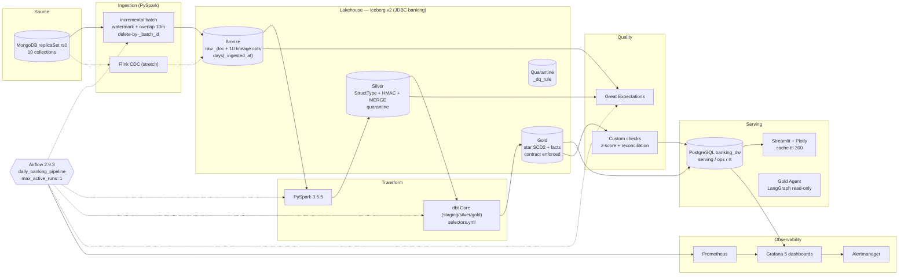
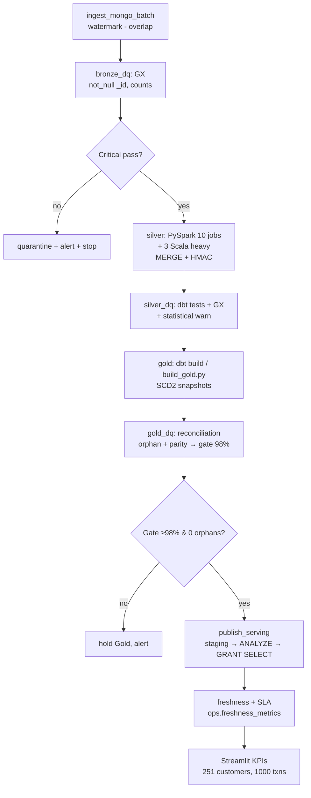

<p align="center">
  
</p>

<h1 align="center">HDFC Banking Data Platform — Lakehouse</h1>

<p align="center">
  <b>MongoDB → Iceberg (Bronze/Silver/Gold) → PostgreSQL → Streamlit</b><br/>
  <i>Batch + SCD2 + DQ gate + SLOs. One command: <code>make setup && make up</code></i>
</p>

<!-- Row 1: Tech Stack -->
<p align="center">
  <a href="https://www.python.org"></a>
  
  
  
  
  
  
  
  
</p>

<!-- Row 2: App + Quality + Release -->
<p align="center">
  
  
  <a href="https://github.com/Nitinx12/Databricks-Streamflix-Lakehouse/actions"></a>
  <a href="https://github.com/Nitinx12/Databricks-Streamflix-Lakehouse/releases"></a>
  
  
  <a href="LICENSE"></a>
</p>

<!-- Row 3: Community -->
<p align="center">
  <a href="https://discord.gg/data-community"></a>
  <a href="https://www.linkedin.com"></a>
  <a href="https://twitter.com"></a>
  <a href="https://github.com/topics/awesome-python"></a>
</p>

<!-- Row 4: CTA -->
<p align="center">
  <a href="https://github.com/Nitinx12/Databricks-Streamflix-Lakehouse"></a>
  <a href="https://github.com/Nitinx12/Databricks-Streamflix-Lakehouse"></a>
  <br/>
  <i>Built with ❤️ for the data community · <a href="LICENSE">MIT License</a> · <a href="https://github.com/Nitinx12/Databricks-Streamflix-Lakehouse/issues/new">Report a bug</a> · ⭐ <a href="https://github.com/Nitinx12/Databricks-Streamflix-Lakehouse">Star on GitHub</a></i>
</p>

<p align="center">
  <a href="https://discord.gg/data-community">💬 Discord chat</a> ·
  <a href="https://www.linkedin.com/in/your-profile">🔗 LinkedIn</a> ·
  <a href="https://twitter.com/your-handle">🐦 Twitter</a>
  <br/>
  <sub><a href="Architecture.md">Architecture</a> · <a href="PROJECT_PLAN.md">Delivery Plan</a> · <a href="docs/runbooks">Runbooks</a> · <a href="docs/slo/error-budget-policy.md">SLOs</a> · Phase <b>5 SLOs proven live</b> → Phase 6 IaC/CD</sub>
</p>

> **Phase 5 SLOs proven live** — forced freshness delay + critical DQ fail drills pass. Scale `20` demo: `Bronze 1529 → Silver 1529 → Gold 251/401/1000/750 → serving parity 100%` (smoke `5/20` → `3809` at `--scale 50`). Iceberg-everywhere on CE (ADR 003 amended 2026-09-21) — Delta fallback not triggered.

---

## ✨ System Design



## 🔄 Data Flow — Daily Pipeline (Architecture 3.2, fail-closed)



- **Idempotent everywhere** — rerun same `batch_id` deletes then appends; Silver/Gold `MERGE` by business key.
- **Contracts at boundaries** — `contracts/*.yml:10` at ingest, `contract enforced true` on Gold `models/gold/schema.yml`.
- **Fail-closed** — `warn` (z-score) never blocks, `critical` (orphan) holds publish per `jobs/quality/gate.py`.

---

## 🚀 Quick Start

```bash
# 1. env
cp .env.example .env   # edit secrets — .env is gitignored, fake secret blocked by hook
# or: make env  (tasks.bat env on Windows)

# 2. setup (WSL2: enable Docker WSL Integration, sudo apt install openjdk-17-jdk)
make setup            # uv sync --all groups + core.hooksPath .githooks
# tasks.bat setup on Windows

# 3. up core (postgres 5433 + mongo rs0 27018 + minio 9000)
make up PROFILE=core  # tasks.bat up core
docker compose ps     # wait healthy
make health           # mongo/postgres/minio probe

# 4. seed — smoke 5/20 or scaled demo
make seed_mongo                          # smoke 5 customers, 20 txns
uv run python scripts/seed_mongo.py --scale 20   # 100/400
uv run python scripts/seed_mongo.py --scale 50   # 250/1000 (current demo)

# 5. full pipeline — one Spark session (177s smoke, 207s scale 50)
uv run python main.py                    # bronze→silver→gold→dq→publish
# or stepwise: make ingest_py && make silver && uv run python scripts/build_gold.py --publish

# 6. verify
make status   # ops.pipeline_runs + watermarks
make monitor  # Prometheus Pushgateway
make dq       # dq gate + dbt test
make dashboard  # http://localhost:8501  (streamlit healthcheck /_stcore/health)
```

**WSL2 note:** `.venv` is not portable — switching Windows ↔ WSL requires `make setup` again. `uv run main.py` now works frozen (`pyproject.toml:72 default-groups`).

### Monitoring Stack

```bash
docker compose --profile monitoring up -d
# Grafana  http://localhost:13000  dashboards in monitoring/grafana/dashboards/01-05
# Prometheus http://localhost:9090  rules monitoring/prometheus/rules/data-slo.yml
# Alertmanager http://localhost:9093  Slack: set SLACK_WEBHOOK_URL in .env
uv run python scripts/proof_slo.py  # forced delay + critical DQ drills (reversible)
```

---

## 🧱 Tech Stack — Detail

| Layer | Tech | Version | Purpose |
|---|---|---|---|
| Ingestion | `pyspark` + `pymongo` + `pyiceberg` | 3.5.5 / 4.6 / 0.8 | Watermark `created_at`, secondaryPreferred, `pyarrow` |
| Lake | `Apache Iceberg` `format-version 2` | 1.5.2 + `hadoop-aws 3.3.4` | `MERGE` `zstd` `days(_ingested_at)` |
| Transform | `dbt-databricks` + `dbt-utils` | 1.8 | `staging view → silver merge → gold incremental` + `snapshots` SCD2 `check` |
| Quality | `Great Expectations` + custom PySpark | 0.18 | `Bronze GX → Silver dbt → Gold reconciliation → statistical z-score` → `ops.dq_results` |
| Serving | `PostgreSQL 16` + `sqlalchemy` | — | `banking_dw.serving` (read-only `streamlit_reader`), `ops`, `rt` |
| Dashboard | `Streamlit 1.35` + `Plotly 5.22` + `pandas 2.2` | — | `st.cache_data ttl 300`, `pool_size 5`, `healthcheck /_stcore/health`, `06_Agent` `st.cache_data ttl 60` |
| Orchestration | `Airflow 2.9.3` `LocalExecutor` | — | `daily_banking_pipeline` `iceberg_maintenance` `sla_monitor` `backfill` |
| Streaming (stretch) | `Flink 1.19 Scala 2.12` SQL | — | `CDC + tumbling/sliding` → `rt.txn_alerts` (Phase 7, `flink/sql/cdc_transactions.sql`) |
| IaC | `Terraform 1.9` `cyrilgdn/postgresql 1.22` `aws 5.0` | — | `modules/postgres/object_storage/databricks/monitoring` + `envs/dev|staging|prod` remote S3 state `use_lockfile` |
| CI/CD | `GitHub Actions` SHA-pinned | — | `ci.yml` (ruff+yamllint+sqlfluff+hadolint+trivy+gitleaks+PII guard), `pin-guard` enforced, Dependabot weekly |
| Agent | `LangGraph + OpenAI` | — | `dashboard/pages/06_Agent.py` over `serving.*` read-only `agents/tools/sql_tool.py` allow-list |

---

## 📦 Repo Layout (Architecture 18 — after renames)

```
.
├── assets/image.png
├── .github/workflows/   ci.yml, cd.yml, terraform_plan.yml, python-ci.yml, pin-guard.yml, ...
├── .githooks/           pre-commit, commit-msg, pre-push (core.hooksPath)
├── airflow/dags/        daily_banking_pipeline.py, sla_monitor.py, iceberg_maintenance.py, ...
├── jobs/                ingestion/bronze.py, transform/silver_*.py + scala/build.sbt, quality/checks.py, publish/serving.py, common/
├── contracts/           10 YAML per collection
├── dbt/banking_dbt/     models/staging|silver|gold + snapshots/ seeds/ selectors.yml + silver/schema.yml [pii]
├── gx/                  great_expectations.yml, checkpoints/, expectations/ (renamed from great_expectations)
├── flink/sql/           cdc_transactions.sql (DataStream sbt deferred)
├── dashboard/           Home.py, pages/01-06_*, lib/db.py (pool) + queries.py (cache), .streamlit/config.toml (renamed from streamlit_app)
├── agents/              LangGraph Gold agent (read-only serving.*)
├── terraform/           modules/{postgres,object_storage,databricks,monitoring} + envs/{dev,staging,prod}/backend.hcl
├── monitoring/          prometheus.yml, alertmanager.yml.tpl, grafana/dashboards/01-05 as code + scala/ helpers
├── scripts/sh|ps1/      12 scripts + lib.sh / lib.ps1 parity (Download-Jars shim)
├── tests/data/fault_injection/  nulls, negative_amounts, orphan_keys
├── sql/init_postgres.sql serving/ops/rt + dq_results/freshness DDL
├── docker-compose.yml   core/orchestration/streaming/quality/monitoring/dashboard profiles
├── pyproject.toml       uv groups ingestion/transform/quality/dashboard/dev + agents
└── Makefile / tasks.bat pipeline + lint/test/health/status/monitor
```

---

## 📊 Gold Today (scale 50 live-verified 2026-09-21)

```
Bronze 3809 (customers 250, accounts 400, transactions 1000, card_txns 750, loans 300, cards 350)
  → Silver 3809 (MERGE dedup + HMAC)
  → Gold  dim_customer 251 (250+1 Unknown), dim_account 401, dim_branch 6, fct_transactions 1000, fct_card_transactions 750
  → serving parity 100% (PostgreSQL 5433)
```

`scripts/seed_mongo.py --scale 1` = smoke `5/8/20`, `--scale 20` = `100/160/400`, `--scale 100` = `500/800/2000`.

---

## ✅ Production Checklist (PROJECT_PLAN 8)

- [x] Idempotent + retries/timeouts, `TRUNCATE watermarks` + `reset_pipeline.py` rebuild proven
- [x] Contracts ×10, DQ gate warn-only + quarantine, reconciliation 100% @ `400` txns
- [x] Metrics/logs/lineage + 5 Grafana dashboards as code, `streamlit` healthcheck
- [x] SLOs defined `Architecture 13.2` (`freshness 24h30 SLO / 26h SLA`, `batch 06:00`), `error-budget-policy.md`
- [ ] Terraform `databricks`/`monitoring` still stub — needs `TF_VAR_*` + OIDC `cd.yml` apply (now wired + `fmt/validate Success`)
- [x] Secrets gitignored, `gitleaks` + `Trivy` + `PII sha256` guard, `Ruff` + `pin-guard` enforced
- [x] Docs + `Architecture`/`PROJECT_PLAN` synced (ADR 12 thin `build.sbt` live)
- **Next:** `1 SHA-pin ✓, 2 Terraform plan ✓, 3 drills ✓, 4 scale 500/2000` — then tag `v1.0.0` (see `docs/incidents/2026-09-21-drills.md`).

---

## 🤝 Contributing

```bash
make lint && make test      # ruff + yamllint -d relaxed + sqlfluff + pytest -q (30 unit)
# hooks: pre-commit <15s (ruff format+check), pre-push <90s (pytest + dbt parse)
```

Conventional Commits `feat:`, `fix:`, `chore:` — `commit-msg` hook enforces. Branch protection: required checks `CI` + `pin-guard`, linear history. See `CONTRIBUTING.md`, `AGENTS.md`.

## 📄 License

MIT — see `LICENSE`. Built with ❤️ for the data community.

<p align="center">
  <sub><a href="https://github.com/Nitinx12/Databricks-Streamflix-Lakehouse/issues/new">Report a bug</a> · <a href="https://github.com/Nitinx12/Databricks-Streamflix-Lakehouse/discussions">Discussions</a> · <a href="https://github.com/Nitinx12/Databricks-Streamflix-Lakehouse">⭐ Star on GitHub</a></sub><br/>
  <a href="https://discord.gg/data-community"></a>
  <a href="https://www.linkedin.com"></a>
  <a href="https://twitter.com"></a>
</p>
