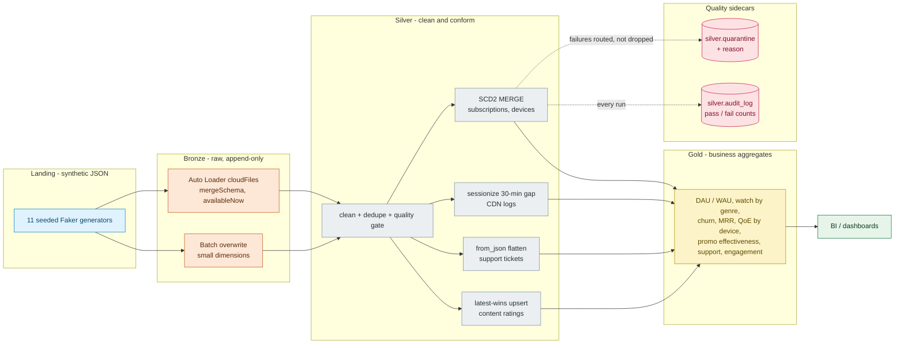

<p align="center">
  
</p>

<h1 align="center">Databricks StreamFlix Lakehouse</h1>

<p align="center">
  A medallion-architecture (bronze → silver → gold) data pipeline for a fictional streaming service, built on Spark + Delta and designed to run identically locally or as a Databricks Job on Unity Catalog — chunked, idempotent, and interview-defensible.
</p>

<p align="center">
  
  
  
  
  
  
  
  
  
</p>

## Architecture



Every Silver write is a MERGE on a natural key, so the pipeline is idempotent
— re-runs are no-ops, backfills are safe. Rows that fail the quality gate are
quarantined with a reason, never dropped.

## Quick start

```bash
uv sync
uv run pytest                              # full test suite (local Spark)
uv run python main.py generate             # synthetic landing data (11 Faker sources)
uv run python main.py pipeline             # bronze -> silver -> gold, locally (~5 min, chunked)
uv run python main.py test-connection      # check Databricks workspace + SQL
uv run python main.py push                 # upload landing/ to CE Volume (chunked, idempotent)
```

Local runs auto-detect (no Databricks runtime): sources are read from
`landing/`, Delta tables land under `.spark/` (gitignored), and terminal
output is rich-formatted with progress bars and summary tables. Every Silver
write is a `MERGE` on a natural key — re-runs are no-ops, quarantine is partitioned by date.

## Running on Databricks CE

1. Create catalog/schemas/volume once — `sql/init_schema.sql` or SQL Editor.
2. `uv run python main.py push` — upload `landing/` to `streamflix-lakehouse.bronze.raw_data`.
3. Create Job: **Python script**, Git source `main`, file `main.py`, params `["pipeline"]`, PyPI `rich`.

Full walkthrough: [docs/DATABRICKS_CE_SETUP.md](docs/DATABRICKS_CE_SETUP.md).

### Performance — chunked for CE

Bronze `cloudFiles.maxFilesPerTrigger=500/128m` `src/jobs/bronze.py:92`, Silver `repartition(4/8)` before window `src/jobs/silver.py:69` + `src/core/sessionization.py:34`, local `repartition(8)` for `watch_events`/`cdn_logs` — avoids single-partition spill. Verified `10:50` run: 9593 watch_events, 1092 sessions, 29 QoE rows.

## Documentation

> Trimmed to 7 core docs — single source of truth, no duplication.

| Doc | Contents |
|---|---|
| [SCHEMA.md](docs/SCHEMA.md) | pipeline flow, ER diagram, Bronze/Silver/Gold table reference |
| [ARCHITECTURE.md](docs/ARCHITECTURE.md) | system flow, repo layout, local vs Databricks execution modes |
| [DATABRICKS_CE_SETUP.md](docs/DATABRICKS_CE_SETUP.md) | populate the CE workspace: DDL, push, Job setup |
| [STREAMING_DESIGN.md](docs/STREAMING_DESIGN.md) | Auto Loader design and 30-minute gap sessionization |
| [SCD2_DESIGN.md](docs/SCD2_DESIGN.md) | SCD Type 2 row model, merge decision flow, idempotency |
| [DATA_QUALITY.md](docs/DATA_QUALITY.md) | quality gate, quarantine reason catalog, audit log |
| [PIPELINE_RUNBOOK.md](docs/PIPELINE_RUNBOOK.md) | commands, fresh end-to-end recipe, common issues |

## Monitoring and ops scripts

`scripts/` carries bash tooling for the three things that can rot silently —
the environment, the local warehouse, and CI — plus bootstrap, smoke, reset,
and secret-audit helpers:

| Script | What it does |
|---|---|
| `bash scripts/setup.sh` | one-shot bootstrap: uv sync, `.env` from template, git hooks, health check |
| `bash scripts/health-check.sh` | pre-flight: uv, python, JDK, lockfile, `.env` keys, landing data per source, `.spark/` state, git hygiene |
| `bash scripts/monitor-pipeline.sh` | local warehouse detail: row counts per bronze/silver/gold table, quarantine by reason, last 12 audit runs, ingest freshness, disk footprint |
| `bash scripts/monitor-ci.sh` | GitHub Actions via `gh`: last runs, per-workflow status, failures in the last 7 days with URLs, nightly E2E health |
| `bash scripts/smoke.sh` | run the nightly E2E workflow locally: ruff, generate (nightly volumes), GX suites, full pytest |
| `bash scripts/reset.sh --rebuild` | wipe disposable local state (`.spark/`) and optionally rebuild with generate + pipeline |
| `bash scripts/audit-secrets.sh` | pre-push hygiene: `.env` tracked status, credential patterns in tracked files and staged changes |

The monitors exit 0 (they report, they don't gate — `health-check.sh` and
`audit-secrets.sh` are the exceptions: they fail on what they find). The
monitors accept `--report` to also write a timestamped file under
`.reports/` (gitignored).

## Tests and CI

`uv run pytest` covers SCD2 idempotency (subscriptions and devices), dedup,
latest-wins upsert, sessionization gap boundaries, and quality gates for all
11 sources. CI (`ci.yml`) runs ruff and the full suite on every push and PR;
a nightly E2E workflow rebuilds everything from a cold runner. Conventional
Commits are enforced on PRs and locally via `.githooks`.

## Repo governance

[CONTRIBUTING.md](CONTRIBUTING.md) covers setup, ground rules, and the PR
checklist; [SECURITY.md](SECURITY.md) the vulnerability-reporting policy and
current watch items. `.github/` carries issue templates, a PR template with
the local checklist, `CODEOWNERS` aligned with labeler areas, and grouped
dependabot updates. Config consistency is enforced by
`tests/test_label_config.py`.
