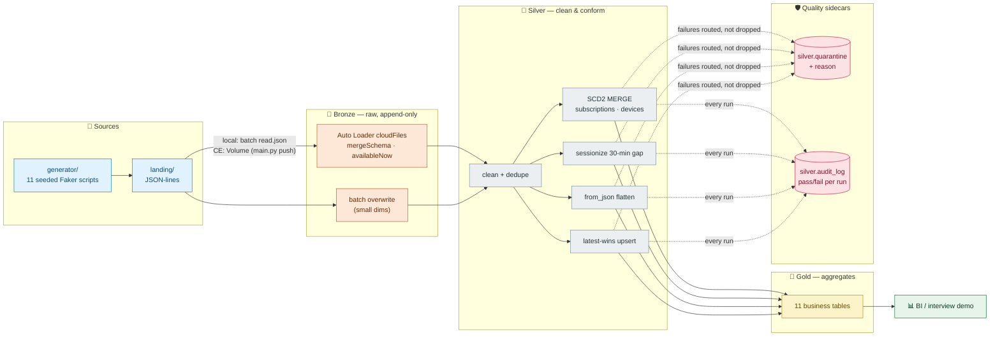

# Architecture

StreamFlix is a medallion lakehouse (Bronze → Silver → Gold) that runs **identically local and on Databricks CE** — same jobs, same idempotency, different I/O plumbing. Table reference: [`SCHEMA.md`](SCHEMA.md) · sources: [`DATA_SOURCES.md`](DATA_SOURCES.md).

## System flow

## Repo layout

| Path | Role |
|---|---|
| `generator/` | 11 seeded Faker scripts — the only source of data |
| `src/jobs/` | `bronze.py`, `silver.py`, `gold.py`, `pipeline.py` — the medallion layers |
| `src/core/` | engine-agnostic logic: `scd2.py`, `sessionization.py`, `transformations.py`, `quality_checks.py`, `io_utils.py` |
| `src/utils/` | `engine.py` (Spark session), `config.py`, `console.py` (rich), `logger.py`, `connection.py` |
| `gx/expectations/` | 11 Great Expectations suites (mirror the quality gate) |
| `tests/` | 11 pytest files — SCD2 idempotency, session boundaries, quality gates |
| `notebooks/` | Databricks notebook mirrors of `src/jobs` |
| `main.py` | CLI: `generate · bronze · silver · gold · pipeline · push · gx · test-connection` |

## Execution modes

`src/utils/engine.py` auto-detects the runtime via `DATABRICKS_RUNTIME_VERSION` — no flags, no separate code paths beyond Bronze's read:

| | Local (`uv run python main.py pipeline`) | Databricks CE (Job: `main.py pipeline`) |
|---|---|---|
| Source read | `spark.read.json(landing/…)` | Auto Loader `cloudFiles` from Volume |
| Warehouse | `.spark/warehouse` (Delta, gitignored) | Unity Catalog `streamflix-lakehouse` |
| Table names | two-part (`silver.x`) | three-part (`` `streamflix-lakehouse`.silver.x ``) |
| Checkpoints | `.spark/checkpoints` | Volume / workspace storage |
| Output | rich console (tables, progress bars) | Job run logs |

Design rule: **all business logic lives in `src/core/` and `src/jobs/`** — pure DataFrame in/out, no environment branches — so a local green run means a Databricks green run.
