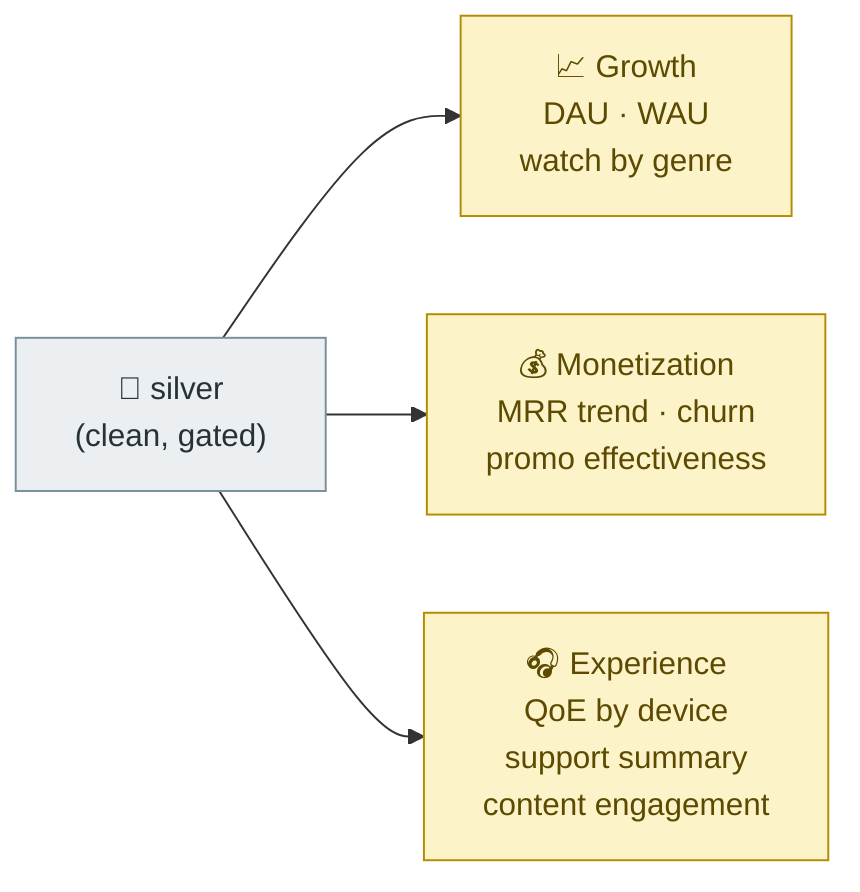

# Business Metrics

The Gold layer answers one business question per table. Each is rebuildable from Silver (overwrite, no state) and is what a dashboard would consume.

## Metric map

## Reference

| Gold table | Question | Grain | Built from |
|---|---|---|---|
| `daily_active_users` | how many users played anything today? | date | `silver.watch_events` |
| `weekly_active_users` | same, rolling week | week | `silver.watch_events` |
| `watch_time_by_genre` | what do people watch? | date × genre | watch_events ⋈ content_catalog (broadcast) |
| `churn_signals` | who cancelled, and when? | user × date | `silver.subscriptions_scd2` (current + history) |
| `mrr_trend` | where is subscription revenue going? | month | `silver.billing` |
| `qoe_by_device` | which devices/genres stream worst? | date × device × genre | `silver.cdn_stream_sessions` ⋈ `devices_scd2` ⋈ catalog |
| `promo_effectiveness` | which promos actually drove revenue? | promo_code | redemptions ⋈ promotions ⋈ billing |
| `support_ticket_summary` | is support load/CSAT improving? | week × channel | `silver.support_tickets` (flattened payload) |
| `content_engagement` | which genres rate highest? | genre | `silver.content_ratings` ⋈ catalog |

## Definition notes

- **Active user** = distinct `user_id` with a watch event in the window — the industry-standard DAU/WAU, not "logged in".
- **Churn** reads SCD2 *history* (`end_date`/`is_current`), so a cancelled-then-resubscribed user is told correctly — this is the payoff of [`SCD2_DESIGN.md`](SCD2_DESIGN.md).
- **QoE** = rebuffer ratio (rebuffer ÷ session duration) and avg bitrate per session — the metrics a streaming SRE team would actually page on.
- **Promo effectiveness** joins the bridge table (`promotion_redemptions`) to both `promotions` (discount cost) and `billing` (revenue attributed), excluding the orphaned-code rows already quarantined in Silver.
- **CSAT** averages only scored tickets (`csat_score` is nullable by design).
