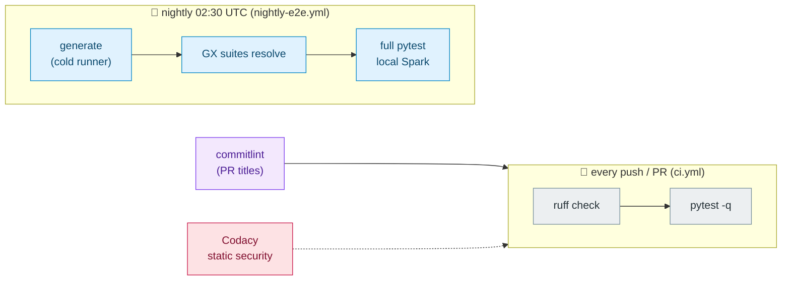

# CI/CD

GitHub Actions runs quality gates on every push/PR, a cold-environment smoke nightly, and repo-hygiene bots. Conventional Commits are enforced both locally (git hook) and on PRs (commitlint).

## Pipelines

## Workflows

| Workflow | Trigger | Purpose |
|---|---|---|
| `ci.yml` | push, PR | `uv sync --frozen` → `ruff check` → `pytest` (cached via setup-uv) |
| `nightly-e2e.yml` | cron 02:30 UTC + manual | cold-runner smoke: generate → GX → full suite; catches JVM/Spark/GX environment rot that warm PR caches miss |
| `commitlint.yml` | PR | enforces Conventional Commit titles (`feat:`, `fix:`, `docs:` …) |
| `codacy.yml` | push | static analysis / security scan |
| `label.yml`, `label-sync.yml` | issues/PRs | label hygiene (verified by `tests/test_label_config.py`) |
| `greetings.yml` | new contributors | welcome comment |
| `summary.yml` | PR | changes summary |

All workflows carry top-level `permissions: contents: read` and `timeout-minutes` — least privilege and no hung runners.

## Workflow contracts are tested

The workflows are guarded by tests that run inside `pytest` on every push:

- `tests/test_workflows.py` (unit) — required workflows exist, `ci.yml` triggers on every push/PR and actually runs ruff + pytest from the frozen lockfile, nightly is cold + manually retriggerable + generates before testing, every action is pinned to a tag or full SHA, `pull_request_target` workflows never check out PR code, and push-triggered workflows stay read-only at the top level.
- `tests/test_ci_smoke.py` (smoke) — runs the CI steps locally: `ruff check .` passes, test collection is clean, all 11 generators produce rows, the shared ID spaces stay coherent, all GX suites resolve, and the CLI surface parses.

A workflow edit that breaks any of these fails CI on the push that introduced it.

## Conventions

- **Tooling**: `uv` only — no bare `pip`. Lockfile (`uv.lock`) is frozen in CI.
- **Commits**: `type(scope?): subject` — types `feat fix docs chore refactor test ci build perf style revert`, header ≤ 72 chars. The `.githooks/commit-msg` hook enforces this locally when `core.hooksPath` is set (`git config core.hooksPath .githooks`).
- **Lint**: `ruff check .` (notebooks excluded) — run before every commit; CI failures here are the most common red X.

## Why nightly matters

PR CI runs on a warm cache with pinned deps, so an upstream break (pyspark/GX release, JVM change) can sail through. The nightly E2E rebuilds the world from zero — generators, GX suites, and the full local-Spark suite — which is exactly the environment a fresh contributor or the Databricks Job sees.
