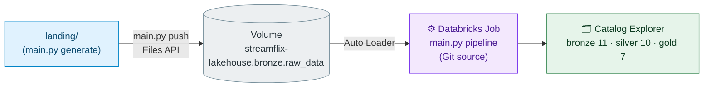

# Databricks CE Setup

How to get the schemas populated in your Community Edition workspace. Local runs never touch Databricks — they build the same tables under `.spark/warehouse`. To populate CE you need: **Volume → Databricks Job → Catalog Explorer**.

## Flow



## 1. One-time DDL (SQL Editor)

```sql
CREATE CATALOG IF NOT EXISTS `streamflix-lakehouse`;
CREATE SCHEMA IF NOT EXISTS `streamflix-lakehouse`.bronze;
CREATE SCHEMA IF NOT EXISTS `streamflix-lakehouse`.silver;
CREATE SCHEMA IF NOT EXISTS `streamflix-lakehouse`.gold;
CREATE SCHEMA IF NOT EXISTS `streamflix-lakehouse`.init_schema;
CREATE VOLUME IF NOT EXISTS `streamflix-lakehouse`.bronze.raw_data;
```

## 2. Push landing data

`.env` needs `DATABRICKS_HOST` + `DATABRICKS_TOKEN` (workspace + Unity Catalog **files** scopes) and `RAW_DATA_PATH=/Volumes/streamflix-lakehouse/bronze/raw_data`. Then:

```
uv run python main.py test-connection   # sanity check first
uv run python main.py push              # landing/ -> Volume, per-table dirs
```

## 3. Create the Job (Jobs UI → Create Job)

| Setting | Value |
|---|---|
| Task type | Python script (`spark_python_task`) |
| Source | **Git** — repo URL, branch `main` |
| Python file | `main.py` |
| Parameters | `pipeline` |
| Libraries (PyPI) | **`rich`** — required, `main.py` imports it on the cluster |
| Cluster | small single-node CE cluster |

The job pulls from GitHub, so **commit and push first** — local working-tree changes are invisible to it.

## 4. Verify + troubleshooting

Catalog Explorer → `streamflix-lakehouse` → bronze (11), silver (10), gold (7). Row counts should match your local run.

| Symptom | Cause |
|---|---|
| Job fails immediately on import | missing `rich` library on the task |
| Bronze tables empty | Volume has no files — re-run `main.py push` |
| `PERMISSION` / 403 on push | CE token lacks files/UC scopes — regenerate with broader scopes |
| Old data won't refresh | Auto Loader checkpoint skips already-seen files; new generate dates produce new filenames |

Re-running the job is always safe — Silver MERGEs make the pipeline idempotent.
