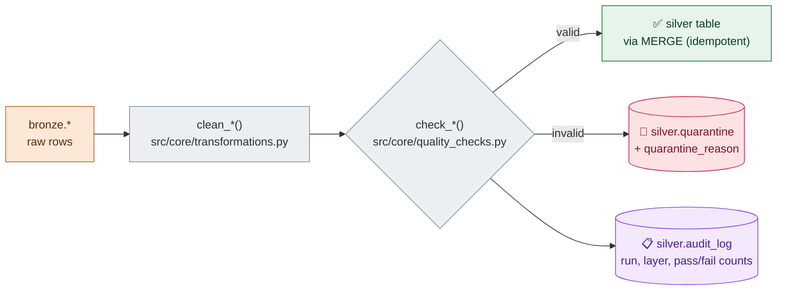

# Data Quality

One gate, three outcomes: **pass**, **quarantine**, **audit**. Nothing is silently dropped — every rejected row is written with a reason, and every run records its counts.

## The gate



Every source has a matching `check_*` function returning a `QualityResult` (passed df, failed df, reasons). Reasons accumulate per row — one bad record can fail for several reasons at once.

## Reason catalog (per source)

| Source | Quarantine reasons |
|---|---|
| `watch_events` | null/duplicate `event_id`, null `user_id`/`content_id`, negative duration, future timestamp, late (7-day SLA) |
| `subscriptions_cdc` | null `subscription_id`, invalid event type, future timestamp |
| `billing` | null/duplicate `transaction_id`, null `user_id`, invalid type, non-positive amount |
| `devices_cdc` | null `device_id`, invalid event type, future timestamp |
| `profiles` | null/duplicate `profile_id`, invalid language |
| `promotions` | null `promo_code`, discount out of range, end-before-start |
| `promotion_redemptions` | null/duplicate `redemption_id`, **orphaned promo_code (FK)**, future timestamp |
| `support_tickets` | null `ticket_id`, invalid status/channel, csat out of range, **unparseable payload** |
| `cdn_stream_logs` | null/duplicate `log_id`, null bitrate, negative rebuffer, future timestamp, late |
| `content_ratings` | null `rating_id`, rating out of range, null user/content |

Deliberate messiness from [`DATA_SOURCES.md`](DATA_SOURCES.md) is engineered to land at a few percent quarantine — enough to demo, not enough to drown the tables.

## Double coverage

The same contracts exist twice, deliberately:

- **Spark gate** (`src/core/quality_checks.py`) — runs in the pipeline, routes rows at runtime.
- **GX suites** (`gx/expectations/*.json`, 11 total) — declarative Great Expectations, runnable independently (`uv run python main.py gx --list`); `tests/test_gx_expectations.py` keeps them in sync with the gate.

## Inspecting

```sql
-- what got rejected, and why
SELECT quarantine_reason, count(*) FROM silver.quarantine GROUP BY 1 ORDER BY 2 DESC;

-- run health over time
SELECT run_ts, pipeline_name, layer, status, records_processed
FROM silver.audit_log ORDER BY run_ts DESC;
```
