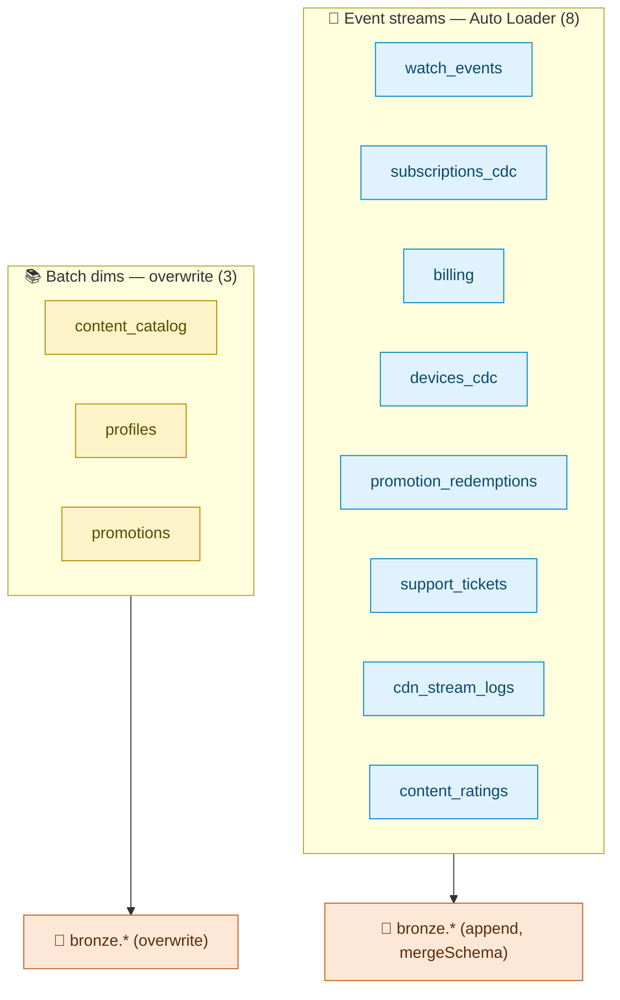

# Data Sources

All 11 sources are **synthetic** — seeded Faker generators in `generator/`, writing JSON-lines to `landing/<table>/`. Every source injects *deliberate messiness* so the Silver quality gate has something real to catch (see [`DATA_QUALITY.md`](DATA_QUALITY.md)).

## Source types

## Reference

| Source | Type | Deliberate messiness | Generator seed |
|---|---|---|---|
| `watch_events` | stream | duplicates, nulls, late-arriving, out-of-order | 43 |
| `subscriptions_cdc` | CDC changelog | insert/update/delete mix, out-of-order | 44 |
| `content_catalog` | batch dim | light nulls | 45 |
| `billing` | stream | duplicate transactions (0.2%), null currency, refunds | 45 |
| `devices_cdc` | CDC changelog | null os_version, out-of-order, future timestamps | 46 |
| `profiles` | batch dim | duplicate profile_id, invalid language | 47 |
| `promotions` | batch dim | end-before-start, discount_pct out of range | 48 |
| `promotion_redemptions` | stream (bridge) | duplicate redemption_id, **orphaned promo_code**, future redeemed_at | 49 |
| `support_tickets` | stream (JSON) | malformed payload JSON, invalid status/channel, csat out of range | 50 |
| `cdn_stream_logs` | stream (telemetry) | duplicate log_id, null bitrate, >30-min gaps, late, future | 51 |
| `content_ratings` | stream (upsert) | re-ratings (latest must win), rating out of range, nulls | 52 |

## Shared ID spaces (referential integrity)

Facts draw from the same deterministic ranges as the dims — this is what makes Gold joins resolve and the bridge-table FK quarantine meaningful rather than random:

| Space | Format | Default range |
|---|---|---|
| Users | `user_{i:06d}` | `range(--users)` (500) |
| Content | `ct_{i:06d}` | `range(--content)` (1000) |
| Promo codes | `PROMO26_{i:06X}` | `range(--promotions)` (200) — shared by `promotions` + `promotion_redemptions` |

Only the deliberate `PROMO26_DOESNOTEXIST` messiness orphans a redemption — everything else is a real FK. Volumes are tuned per CLI flag (`uv run python main.py generate --help`); `cdn_stream_logs` defaults highest (high-volume telemetry demo).

## Freshness contract

Event generators use a **5-day window**; the Silver gate rejects anything older than 7 days (`late_arriving_7d`). The window is deliberately *shorter* than the SLA so the only rows quarantined for lateness are the injected ones — normal history passes.
