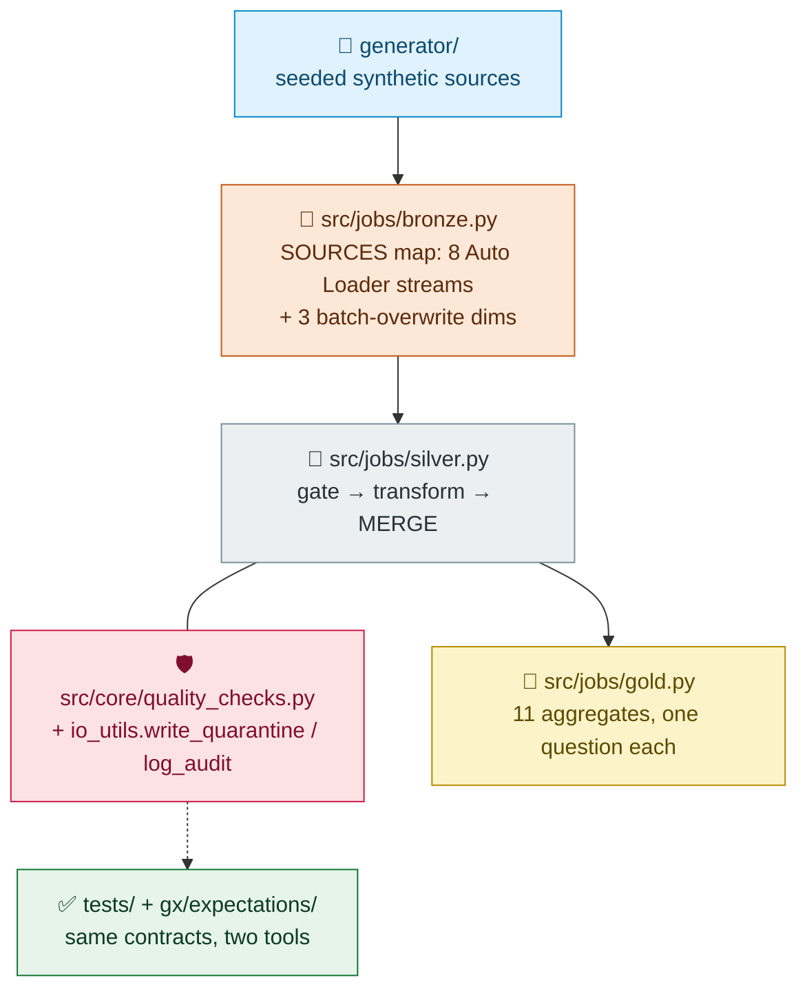

# Medallion Mapping

Layer-by-layer: what each layer guarantees, and the exact code that implements it. This is the "point at the code" cheat sheet for interviews.

## Layers → code

## Concept → code

| Concept | Where | Note |
|---|---|---|
| Bronze raw capture | `src/jobs/bronze.py` (`SOURCES`, `_ingest_databricks`) | append-only, `_ingested_at`/`_source_file` lineage cols |
| Quality gate + quarantine | `src/core/quality_checks.py` + `io_utils.py` | pass/fail split with `quarantine_reason`; failures routed, never dropped |
| Idempotent writes | `src/jobs/silver.py` (`_merge_or_create`) | MERGE on natural key — re-runs are no-ops |
| SCD Type 2 | `src/core/scd2.py` (`apply_scd2_generic`) | subscriptions **and** devices share one generic core |
| CDC handling | `apply_scd2_generic(event_col=…)` | delete closes the row, no new current |
| Sessionization | `src/core/sessionization.py` | 30-min inactivity gap → new `session_number` |
| Semi-structured parsing | `transformations.clean_support_tickets` | `from_json` + flatten; unparseable → quarantine |
| Upsert / latest-wins | `clean_content_ratings` + Silver MERGE | key is `(user_id, content_id)`, **not** the PK |
| Factless fact (bridge) | `check_promotion_redemptions` | FK vs `promotions` dim; orphans quarantined |
| Partitioning | Silver tables | `event_date`, `created_date`, `session_date` |
| Dual runtime | `src/utils/engine.py` | local vs Databricks auto-detect, same jobs |

## Layer contracts

| Layer | Guarantee | Check |
|---|---|---|
| Bronze | raw fidelity — nothing dropped or mutated at ingest | `_source_file` + append-only |
| Silver | typed, deduped, quality-gated, idempotent | `silver.quarantine` + `silver.audit_log` |
| Gold | one business question per table, rebuildable | overwrite from SQL, no state |
