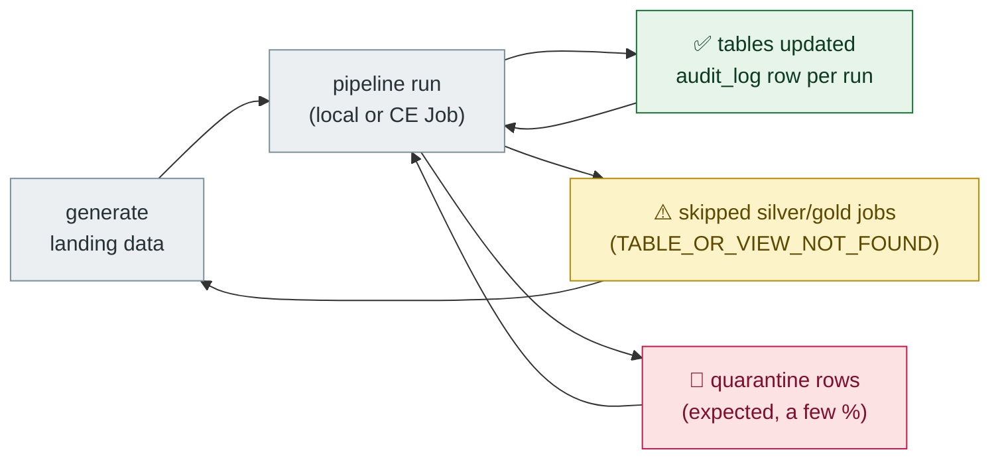

# Pipeline Runbook

Everything you need to run, re-run, and un-stick the pipeline.

## Commands

| Command | What it does |
|---|---|
| `uv run python main.py generate` | write fresh synthetic data to `landing/` (volumes via `--users --content --watch …`, see `--help`) |
| `uv run python main.py pipeline` | bronze → silver → gold, with progress bars + summary table |
| `uv run python main.py bronze --what watch_events` | one bronze source |
| `uv run python main.py silver --what devices_scd2` | one silver job |
| `uv run python main.py gold --what all` | one/all gold aggregates |
| `uv run python main.py push` | upload `landing/` to the CE Volume ([setup](DATABRICKS_CE_SETUP.md)) |
| `uv run python main.py gx --list` | list GX expectation suites |
| `uv run python main.py test-connection` | check workspace + SQL warehouse + imports |
| `uv run pytest -q` | full test suite (~3–5 min, local Spark) |
| `uv run ruff check .` | lint |

## Fresh end-to-end (local)

```
uv run python main.py generate
uv run python main.py pipeline
```

That's it. First pipeline run bootstraps `.spark/warehouse`; every later run is **idempotent** — Silver MERGEs on natural keys, Gold overwrites from SQL, so re-runs converge instead of duplicating.

## Operating states



## Common issues

| Symptom | Fix |
|---|---|
| "no landing data" warnings in bronze | run `generate` first (or check the source dir isn't empty) |
| silver/gold jobs skipped with a warning | expected when their bronze source is empty — the pipeline continues, doesn't crash |
| high quarantine counts | inspect `silver.quarantine` by reason — see [DATA_QUALITY.md](DATA_QUALITY.md) |
| stale tables after schema/config changes | wipe local state: `Remove-Item -Recurse -Force .spark` (PowerShell), then re-run pipeline |
| Databricks side empty | follow [DATABRICKS_CE_SETUP.md](DATABRICKS_CE_SETUP.md) — local runs never touch CE |
| CE token errors | `main.py test-connection`, then regenerate the token with workspace + UC files scopes |

## What lives where (local mode)

| Path | Contents |
|---|---|
| `landing/<table>/` | source JSON-lines |
| `.spark/warehouse/` | Delta tables (the medallion) |
| `.spark/checkpoints/` | Auto Loader state (local mode unused, kept for parity) |
| `.spark/quarantine/` | quarantined rows |
