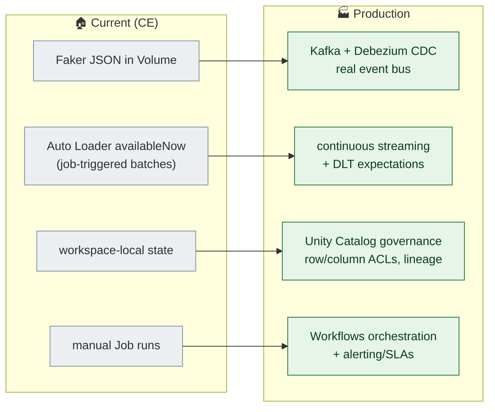

# Production Upgrade

What changes moving from a CE portfolio project to production. Every gap below is a **conscious simplification**, not an oversight — each is the standard "what would you do at scale?" interview answer.

## Now → target

## Upgrade items

| Area | Today | Production |
|---|---|---|
| CDC source | synthetic changelog JSON | Kafka + Debezium capturing the OLTP database; schema-registry-managed topics |
| Trigger | `availableNow` per job run | continuous streaming with watermarks; Workflows for batch dims |
| Orchestration | single `pipeline` command | Databricks Workflows DAG (bronze → silver → gold with task dependencies, retries, SLA alerts) |
| Quality | custom gate + GX suites | DLT expectations (quarantine semantics preserved) + incident paging |
| Governance | single catalog, PAT in `.env` | service principals, scoped tokens / OAuth, row + column-level security, UC lineage capture |
| Storage layout | default Delta | OPTIMIZE + Z-ORDER / liquid clustering; VACUUM retention policy |
| Monitoring | `silver.audit_log` + rich tables | same audit tables surfaced in dashboards; alert on quarantine-rate spikes |
| Backfills | re-generate + re-run (idempotent MERGEs make it safe) | same MERGE keys are exactly what makes controlled backfills possible — this part survives unchanged |

## Deliberate deferrals (and why they're fine here)

- **`silver.billing` appends instead of MERGE** — pre-existing; the natural key (`transaction_id`) and `_merge_or_create` helper make the fix mechanical, but it's out of scope and flagged in [`SCHEMA.md`](SCHEMA.md).
- **No surrogate keys on SCD2 dims** — `subscription_id`/`device_id` are stable business keys; surrogate keys buy nothing at this scale.
- **Event-time watermarks** — `availableNow` batches make them moot locally; they arrive with continuous streaming.
- **No users dimension** — `user_id` is a shared logical key across facts (documented in [`SCHEMA.md`](SCHEMA.md)).

The load-bearing design choices — **quality gate with quarantine, MERGE-on-natural-key idempotency, SCD2 history, sessionization on event time** — are the same ones production would run; only the transport and governance around them change.
