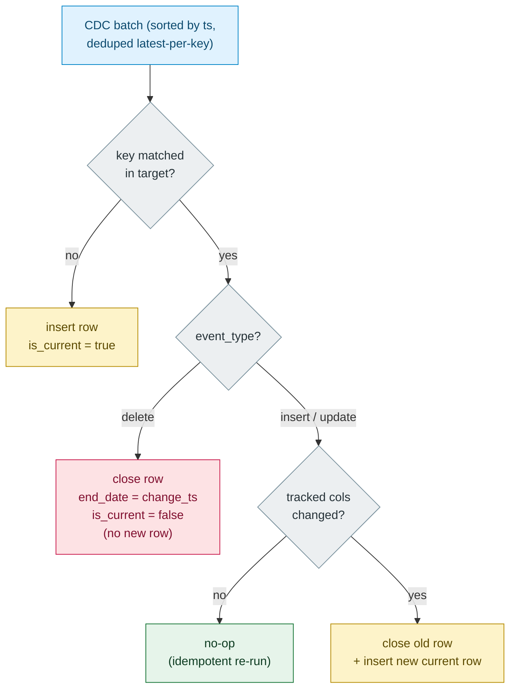

# SCD2 Design

Type 2 slowly-changing dimensions for `subscriptions` and `devices`: every change is a **new row**, history is preserved, "current" is queryable in one filter.

## Row model

Every Silver dim row carries the standard SCD2 bookkeeping:

| Column | Meaning |
|---|---|
| `<key>` | business key (`subscription_id` / `device_id`) |
| tracked columns | the attributes we version |
| `effective_date` | when this version became true |
| `end_date` | when it stopped being true (`NULL` = current) |
| `is_current` | exactly one `true` per key |

## Merge decision flow

`src/core/scd2.py` is **table-agnostic** — `apply_scd2_generic` / `build_merge_sql_generic` take key, tracked cols, ts, and event type. The subscriptions-specific `apply_scd2` is a thin wrapper.



## Configured dimensions

| Dim | Key | Tracked columns |
|---|---|---|
| `silver.subscriptions_scd2` | `subscription_id` | `user_id`, `plan_tier`, `status` |
| `silver.devices_scd2` | `device_id` | `user_id`, `device_type`, `os_family`, `os_version`, `app_version`, `is_primary` |

## Idempotency (the interview point)

- The CDC batch is sorted and collapsed **latest-per-key first**, so replaying a changelog can't resurrect old versions.
- Unchanged tracked columns are a no-op — `test_devices_scd2_idempotent_repeat_run` runs the merge twice and asserts identical row counts.
- First run bootstraps via `write_delta(overwrite)`; every later run goes through the MERGE.

## Querying

```sql
-- current state
SELECT * FROM silver.devices_scd2 WHERE is_current;

-- device history as of a point in time
SELECT * FROM silver.devices_scd2
WHERE effective_date <= '2026-01-01' AND (end_date IS NULL OR end_date > '2026-01-01');
```
