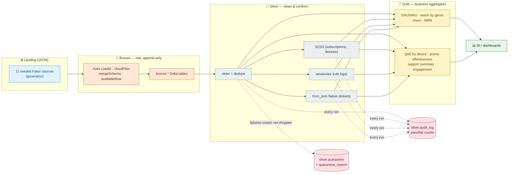
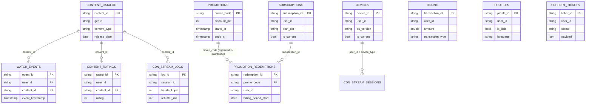

# Schema

Data model and pipeline map for the StreamFlix lakehouse (11 source tables, Bronze → Silver → Gold).
Full column-level detail: [`data_dictionary.md`](data_dictionary.md) · lineage: [`lineage.md`](lineage.md).

## Pipeline flow

## Relationships

`user_id` is a logical key shared by all event/fact tables (no users dim yet). Solid links are enforced-by-quarantine FKs.

## Table reference

### Bronze (raw, `_ingested_at`/`_source_file` added)

| Table | Key | Pattern |
|---|---|---|
| `watch_events` | `event_id` | Auto Loader stream |
| `subscriptions_cdc` | `subscription_id` + ts | CDC changelog (insert/update/delete) |
| `content_catalog` | `content_id` | Batch overwrite dim |
| `billing_transactions` | `transaction_id` | Auto Loader stream |
| `devices_cdc` | `device_id` + ts | CDC changelog (2nd SCD2 source) |
| `profiles` | `profile_id` | Batch overwrite dim |
| `promotions` | `promo_code` | Batch overwrite dim |
| `promotion_redemptions` | `redemption_id` | Auto Loader stream (bridge) |
| `support_tickets` | `ticket_id` | Auto Loader stream (JSON payload) |
| `cdn_stream_logs` | `log_id` | Auto Loader stream (high volume) |
| `content_ratings` | `rating_id` | Auto Loader stream |

### Silver (cleaned, quality-gated)

| Table | Natural key | Idempotency | Partition |
|---|---|---|---|
| `watch_events` | `event_id` | MERGE | `event_date` |
| `subscriptions_scd2` | `subscription_id` | SCD2 MERGE | — |
| `content_catalog` | `content_id` | overwrite | — |
| `billing` | `transaction_id` | append* | — |
| `devices_scd2` | `device_id` | SCD2 MERGE | — |
| `profiles` | `profile_id` | overwrite | — |
| `promotions` | `promo_code` | overwrite | — |
| `promotion_redemptions` | `redemption_id` | MERGE | — |
| `support_tickets` | `ticket_id` | MERGE | `created_date` |
| `cdn_stream_sessions` | `session_id` + `session_number` | MERGE | `session_date` |
| `content_ratings` | `user_id` + `content_id` | MERGE (latest-wins upsert) | — |

\* pre-existing; candidate for a MERGE follow-up.

### Gold (one business question per table)

| Table | Question |
|---|---|
| `daily_active_users` / `weekly_active_users` | How many users are active? |
| `watch_time_by_genre` | What do people watch? |
| `churn_signals` / `mrr_trend` | Who churned, what's the revenue trend? |
| `qoe_by_device` | Which devices/genres stream worst? |
| `promo_effectiveness` | Which promos drove revenue? |
| `support_ticket_summary` | Is support load/CSAT improving? |
| `content_engagement` | Which genres rate highest? |
