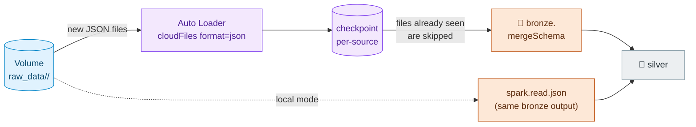
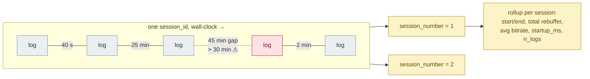

# Streaming Design

Two streaming problems, solved with bounded machinery: **Auto Loader ingestion** and **gap-based sessionization**. Both are trigger-per-batch (`availableNow`) — the "streaming" is incremental state, not always-on clusters.

## Ingestion path

Key choices:

- **`cloudFiles` + `mergeSchema`** — new fields in source JSON don't break ingestion; they land in Bronze for triage.
- **`trigger(availableNow=True)`** — processes everything pending once, then stops. Cheaper than continuous mode, and the checkpoint still guarantees exactly-once file tracking across runs.
- **Per-source checkpoints** — re-running one table's ingest can never double-count another's.
- **Local fallback** — the same Bronze schema is produced by a batch `read.json`, so Silver/Gold never know which mode ran.

## Sessionization (cdn_stream_logs)

CDN logs are heartbeats: 5–30 logs per playback session, positions advancing. One `session_id` can span real breaks — a **>30-min inactivity gap** starts a new session segment.

`src/core/sessionization.py`:

- `sessionize(df, key, ts_col, gap_minutes=30)` — per-key `lag` over an event-time window; running sum of gap-indicators = `session_number`. A gap of **exactly** 30 min is still the same session (boundary is `>`, not `>=`).
- `rollup_sessions(df)` — one row per (key, session): duration, rebuffer total, avg bitrate, first-log startup latency.

Both are pure DataFrame functions — unit-tested in `tests/test_sessionization.py` (gap boundary, single-event sessions, per-key independence, out-of-order input).

## Late & out-of-order data

Event streams aren't sorted by arrival or event time. Silver handles it in two places: the **quality gate** flags events older than the 7-day SLA or in the future (→ quarantine), and **sessionization orders by event time within its window**, so out-of-order arrival doesn't corrupt session assignment.
