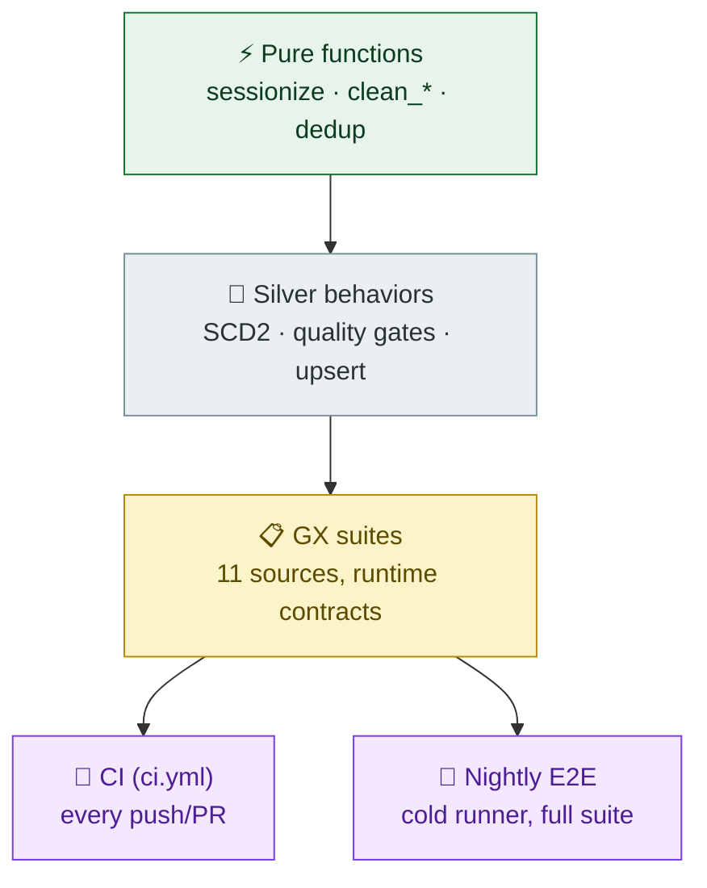

# Testing

Two rings: fast pure-PySpark unit tests (every PR) and declarative GX suites (runtime contracts). Everything runs on local Spark — no Databricks needed.

## Test strategy



## Inventory (`tests/`, 13 files)

| File | Covers |
|---|---|
| `test_sessionization.py` | gap boundary (**exactly 30 min = same session**), single-event sessions, per-key independence, out-of-order input, rollup metrics |
| `test_scd2.py` | subscriptions SCD2 — insert/update/delete + repeat-run idempotency |
| `test_devices_scd2.py` | the generic SCD2 core on a 2nd dim — insert, delete-closes-row, **idempotent repeat run**, unsorted input |
| `test_new_quality_checks.py` | one deliberately-bad-record test per new source (devices → ratings) |
| `test_quality_checks.py` | original gate: watch_events, subscriptions, billing |
| `test_content_ratings.py` | latest-wins re-rating dedup + idempotent re-run |
| `test_billing_idempotency.py` | silver.billing MERGE regression: re-run appends nothing, duplicate txn deduped, invalid rows quarantined (own Delta-enabled temp warehouse) |
| `test_dedup.py` | duplicate handling |
| `test_data_validations.py` | transformation-level validation |
| `test_gx_expectations.py` | GX suites stay in sync with the Spark gate |
| `test_label_config.py` | CI workflow hygiene (permissions, timeouts, labels) |
| `test_workflows.py` | workflow contracts as unit tests: required workflows, push triggers, CI steps, action pinning, `pull_request_target` no-checkout rule, read-only push permissions |
| `test_ci_smoke.py` | smoke tests mirroring the CI steps locally: ruff passes, collection is clean, all generators produce rows, ID spaces shared, all 11 GX suites resolve, CLI parses |

## What's deliberately tested hard

- **Idempotency** — the strongest claim of the pipeline ("re-run is a no-op") is asserted, not assumed: SCD2 repeat runs, upsert re-runs, dedup.
- **Boundaries** — sessionization at exactly the gap threshold; quality checks at exactly invalid values.
- **Behavior, not SQL strings** — tests assert DataFrames out of pure functions, so they survive refactors of the MERGE plumbing.
- **The CI itself** — `test_workflows.py` + `test_ci_smoke.py` run inside `pytest` on every push, so a workflow file that loses its trigger, steps, or least-privilege permissions fails the build before GitHub schedules it.

## GX suites (`gx/expectations/`, 11 files)

Declarative contracts per source (`expectation_suite_name`, expectations with `meta.reason` tied to generator messiness, `meta.streamflix_layer` + `quarantine_table`). They mirror the Spark gate — same rules, two independent tools — and `test_gx_expectations.py` fails if the two drift apart.

## Running

```
uv run pytest -q          # full suite (~3–5 min, local Spark)
uv run pytest tests/test_sessionization.py -q   # one file
uv run python main.py gx --list                  # list GX suites
```
